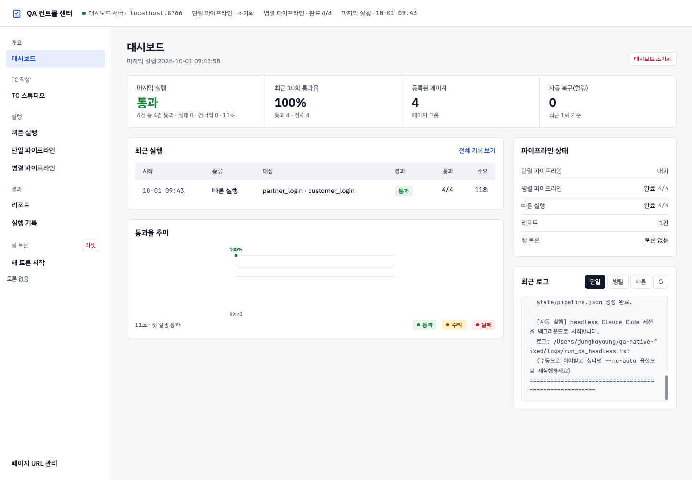
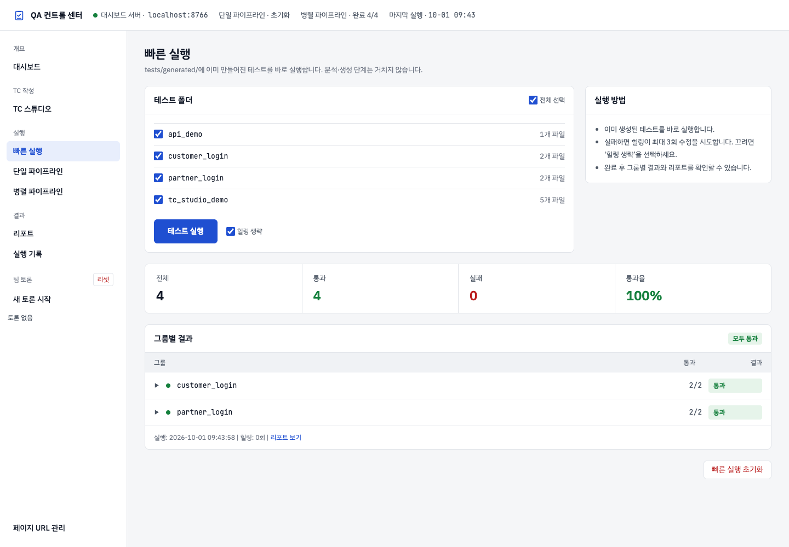
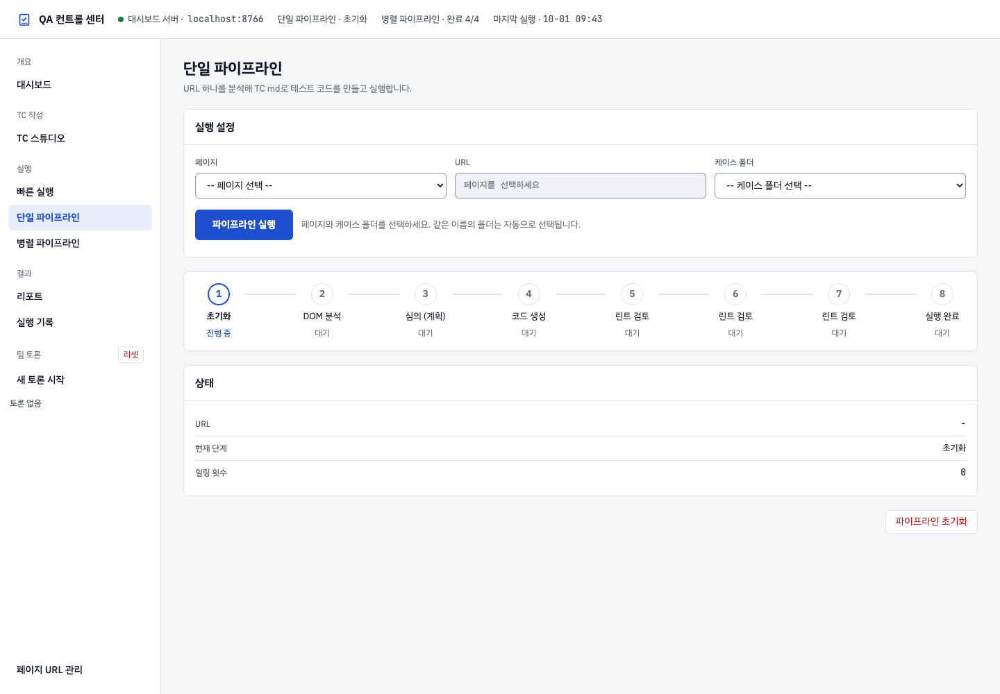
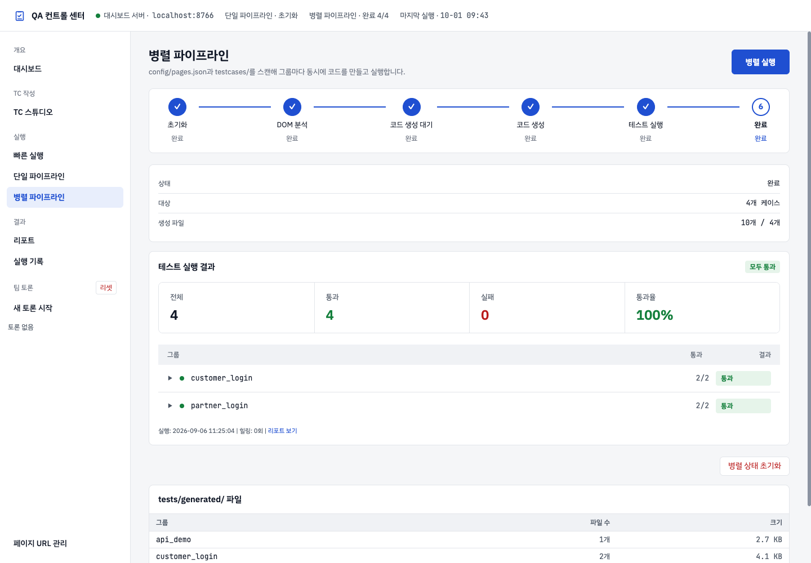
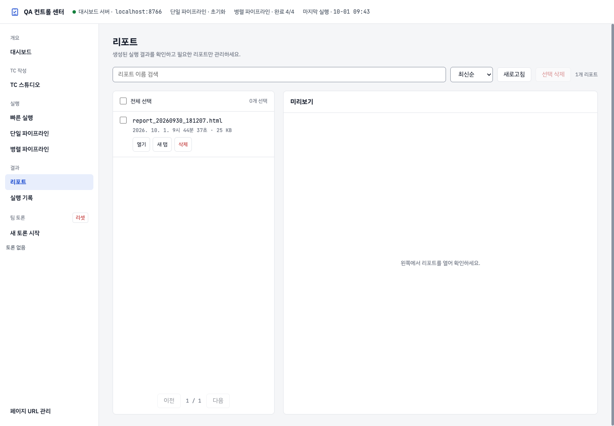
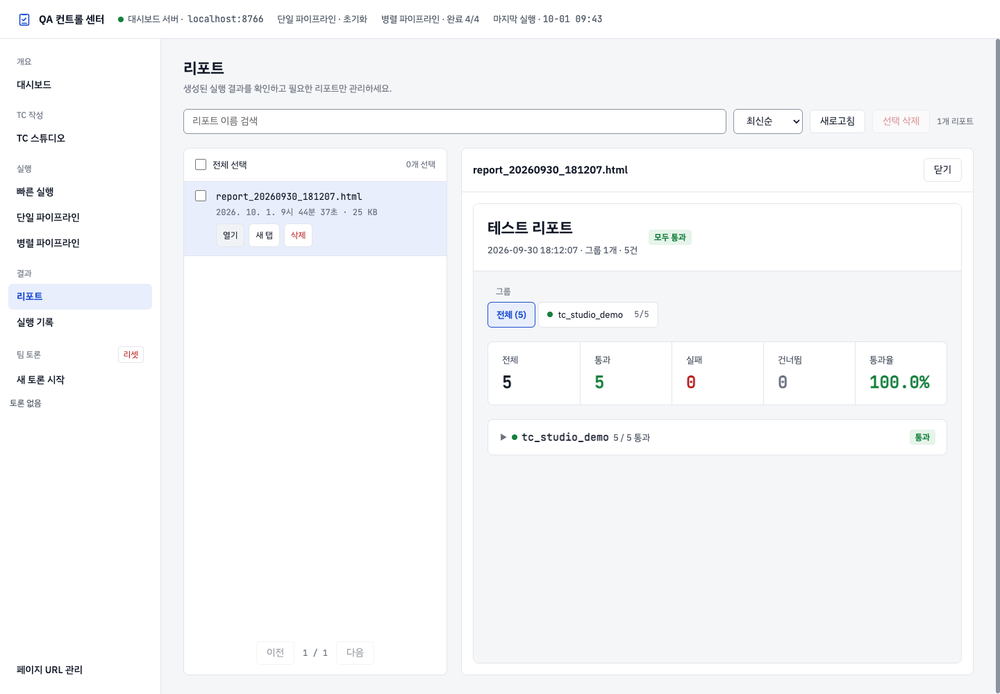
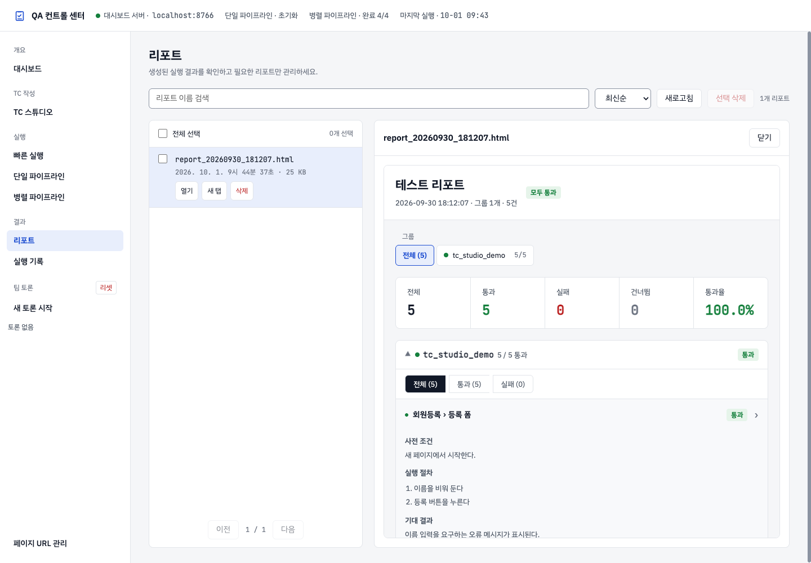
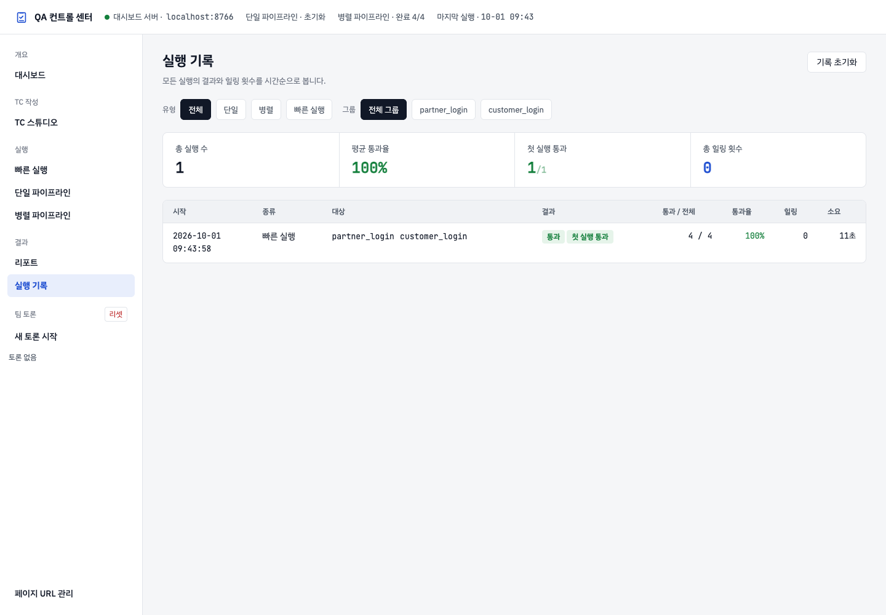
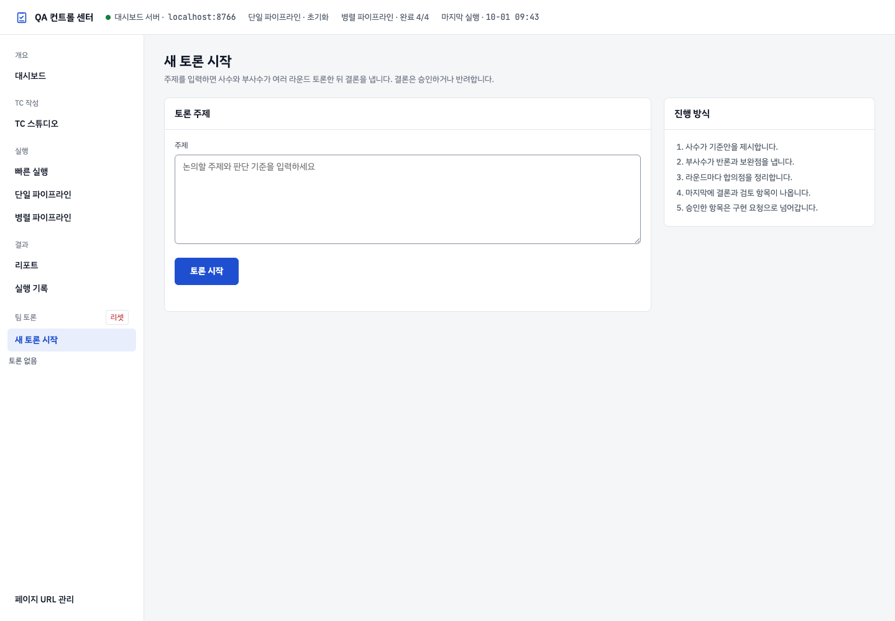
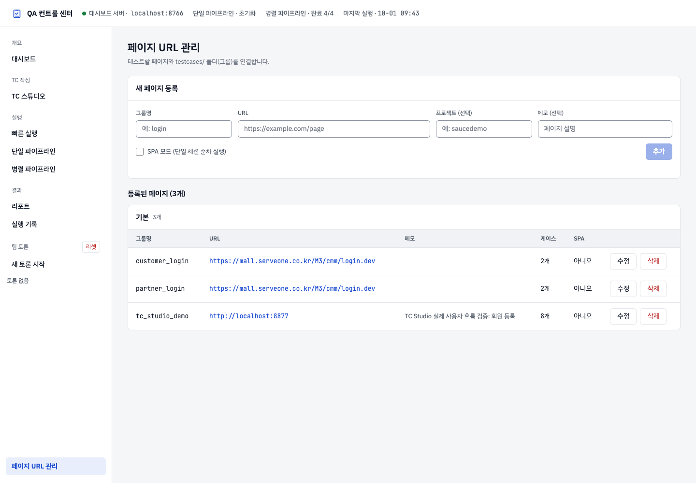

# 웹 QA 대시보드 사용자 가이드

- 화면 기준: **2026-10-02 최신 밝은 테마**. 주의는 노란 배경, 실패는 연한 빨간 배경으로 구분합니다.
- 주소: **http://localhost:8766/**. 서버 주소나 포트가 다르면 관리자가 제공한 주소를 사용합니다.
- 이미지: 현재 대시보드에서 Playwright로 촬영했습니다. 스위트·그룹 이름, 건수와 시각은 이 PC의 예시 데이터이며 사용자 환경에서는 달라집니다.
- TC 작성부터 내보내기까지는 [TC 스튜디오 사용자 설명서](tc-studio/TC_AUTHORING_USER_GUIDE.md)를 읽으세요. 이 문서는 대시보드 메뉴와 리포트를 안내합니다.

## 1. 접속과 메뉴

프로젝트 루트에서 서버를 켭니다. 설치는 [README](../../README.md#설치)를 참고하세요.

```sh
python3 agents/dashboard/serve.py --port 8766
```

브라우저에서 위 주소를 엽니다. 왼쪽 메뉴로 화면을 바꾸고, 상단 **QA 컨트롤 센터**를 누르면 대시보드로 돌아옵니다. 파이프라인 실행·TC 초안 생성에는 로컬 Claude CLI가 설치되고 로그인되어 있어야 합니다.

| 메뉴 | 목적 |
|---|---|
| 대시보드 | 현재 상태와 최근 실행 추이를 한눈에 확인 |
| TC 스튜디오 | 기획 입력, TC 생성·직접 작성·수정·검토, Excel·Markdown 내보내기 |
| 빠른 실행 | 이미 만들어진 테스트 코드 실행 |
| 단일 파이프라인 | 한 URL의 TC로 테스트 코드 생성과 실행 |
| 병렬 파이프라인 | 여러 그룹의 코드 생성과 실행 |
| 리포트 | 저장된 HTML 결과지 검색·열기·관리 |
| 실행 기록 | 이전 실행 결과와 통과율 비교 |
| 새 토론 시작 | 주제를 등록하고 팀 토론 진행 |
| 페이지 URL 관리 | 그룹별 URL 등록·수정 |

## 2. 대시보드와 상태 표시



요약과 최근 실행 추이에서 통과·주의·실패를 확인합니다. **통과는 초록 배경, 주의는 노란 배경, 실패는 연한 빨간 배경**이며 글자로도 상태를 표시합니다. 주의 표시는 상세 확인이 필요한 상태입니다. 구체적인 원인은 해당 실행 화면에서 확인하세요.

상단에는 서버 주소와 단일·병렬 파이프라인 상태가 표시됩니다. 실행이 끝났는지는 단계 표시와 결과 건수를 함께 확인합니다. 화면에 결과가 없으면 아직 실행 이력이 없는 환경일 수 있습니다.

## 3. TC 스튜디오

왼쪽 **TC 스튜디오**를 누릅니다. 기존 스위트를 선택하면 저장된 TC가 열리므로 Excel을 다시 올릴 필요가 없습니다.

**기획 정보 · 생성 → 초안 검토 → 라이브러리 → 내보내기** 순서로 작업합니다. 직접 작성하거나 Excel로 가져올 수도 있습니다. 시트 추가·이름 변경, 빈 분류 작성, 작성 규칙 편집과 Markdown 반영 조건은 [자세한 설명서](tc-studio/TC_AUTHORING_USER_GUIDE.md)에 있습니다. 별도의 Import Studio 메뉴는 TC 스튜디오에 통합되어 있습니다.

## 4. 빠른 실행



1. **빠른 실행**에서 실행할 그룹을 선택합니다.
2. 실패한 테스트의 자동 수정을 사용하지 않으려면 **힐링 생략**을 선택합니다.
3. **테스트 실행**을 누릅니다.
4. 진행 로그와 결과의 통과·실패·건너뜀 건수를 확인합니다.

빠른 실행은 `tests/generated/`에 있는 코드를 실행합니다. 새 기획이나 TC로 코드를 만들려면 단일·병렬 파이프라인을 사용하세요. **건너뜀**은 테스트가 실행되지 않은 결과이며 통과와 다릅니다. 결과 항목의 사유를 읽으세요.

## 5. 단일 파이프라인



1. **단일 파이프라인**에서 페이지와 TC 폴더를 선택합니다.
2. 대상 URL과 케이스 폴더가 맞는지 확인합니다.
3. **파이프라인 실행**을 누릅니다.
4. 단계 표시와 로그를 확인합니다. 분석·코드 생성·리뷰·실행·필요한 실패 수정이 이어집니다.
5. 완료 후 결과를 펼쳐 확인하고 저장된 리포트를 엽니다.

실행 버튼을 반복해서 누르지 말고 진행 상태를 확인합니다. **파이프라인 초기화**는 실행 시작 버튼이 아닙니다. 현재 결과를 확인한 뒤 상태를 초기화할 때 사용합니다.

## 6. 병렬 파이프라인



**병렬 실행**을 누르면 등록된 페이지와 TC 그룹을 기준으로 작업합니다. 그룹별 진행 상태와 로그를 확인하고 완료 후 통합 결과를 봅니다. URL과 그룹 준비는 [페이지 URL 관리](#10-페이지-url-관리)를 참고하세요.

표시되는 통과율만 보지 말고 실패·건너뜀 건수도 함께 확인합니다. 자동 수정 한도에 도달한 항목은 오류 내용을 확인하고 수정해야 합니다.

## 7. 리포트 목록과 결과지 열기



1. **리포트** 메뉴를 엽니다.
2. 파일 이름으로 검색하거나 **최신순 / 오래된순 / 파일명순**으로 정렬합니다.
3. 목록의 **열기**를 누르면 오른쪽 영역에서 결과지가 열립니다.
4. 넓게 보려면 열린 결과지의 **새 탭** 링크를 사용합니다.
5. 목록이 오래되었으면 **새로고침**을 누릅니다.



결과지는 대시보드와 같은 밝은 테마입니다. 통과·실패·건너뜀과 통과율을 확인한 뒤 그룹을 펼칩니다. **전체 / 통과 / 실패 / 건너뜀** 필터는 해당 결과를 찾는 데 사용합니다. 항목이 많으면 페이지 버튼으로 이동합니다.



TC 제목을 누르면 상세 내용이 펼쳐집니다. 저장된 자료가 있으면 수행 절차, 기대 결과와 실패 정보·스크린샷·영상·Trace를 확인할 수 있습니다. 모든 항목에 영상이나 Trace가 있는 것은 아닙니다.

과거에 생성된 지원 형식의 결과지도 열 때 최신 테마로 표시합니다. 원본 파일은 덮어쓰지 않습니다. 저장된 파일을 PC에서 직접 여는 것과 대시보드의 **열기**로 보는 것은 다를 수 있습니다.

삭제하려면 대상 체크박스를 확인하고 **선택 삭제** 또는 해당 행의 삭제 기능을 사용합니다. 삭제한 파일의 열린 링크에서는 삭제 안내가 표시됩니다.

## 8. 실행 기록



**실행 기록**에서 실행 시각, 그룹과 결과를 비교합니다. 필터를 사용한 상태에서 목록이 적게 보이면 필터를 다시 확인하세요. 개별 오류와 저장된 상세 자료는 해당 실행 결과와 리포트에서 봅니다.

## 9. 팀 토론



**새 토론 시작**에서 주제를 입력하고 화면의 시작 버튼을 누릅니다. 생성된 토론은 왼쪽 팀 토론 목록에서 다시 열 수 있습니다. 결론에 대한 승인·반려는 내용을 읽은 뒤 결정합니다. 승인한 항목은 후속 구현 작업으로 이어질 수 있습니다.

## 10. 페이지 URL 관리



1. **페이지 URL 관리**의 **새 페이지 등록**에서 그룹명과 URL을 입력합니다.
2. 필요한 프로젝트와 메모를 입력합니다.
3. **추가**를 누르고 목록에 등록된 내용을 확인합니다.
4. 기존 항목은 **수정**을 누르고 변경 후 **저장**합니다.

그룹명은 TC 폴더와 연결되며 TC 스튜디오의 Markdown 내보내기 매핑에서도 사용합니다. Markdown 미리보기와 반영은 [TC 스튜디오 설명서 5장](tc-studio/TC_AUTHORING_USER_GUIDE.md#5-같은-tc를-markdown으로-내보내기)을 참고하세요.

## 11. 화면이 이전 버전으로 보일 때

- 새로고침하고 주소·포트가 작업 중인 서버와 같은지 확인합니다.
- 리포트는 대시보드의 **리포트 → 열기**로 다시 엽니다.
- Python 서버 코드가 업데이트된 경우 서버를 재시작합니다. 실행 중인 파이프라인이 있다면 담당자와 재시작 시점을 정합니다.
- 문제가 계속되면 화면 이름, 누른 버튼, 오류 문구와 시각을 함께 전달합니다.
