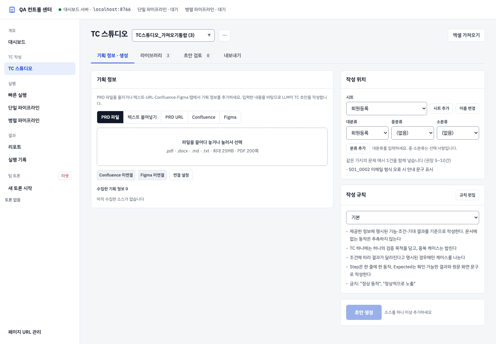
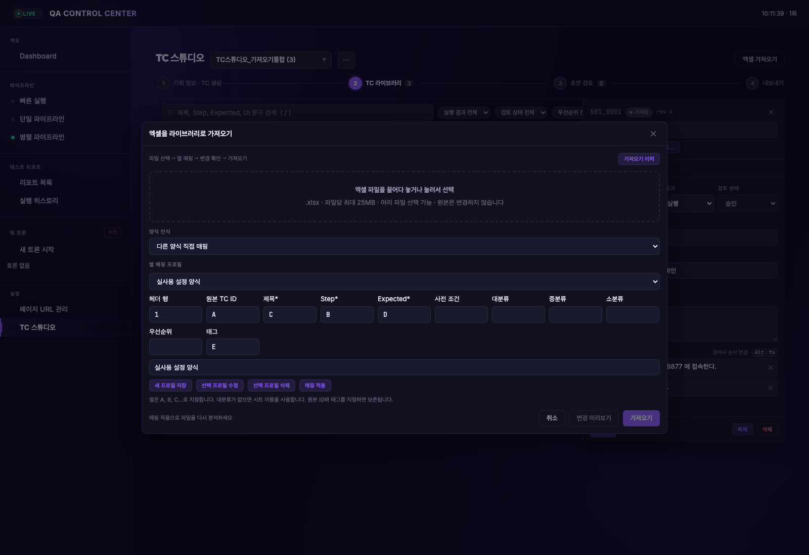
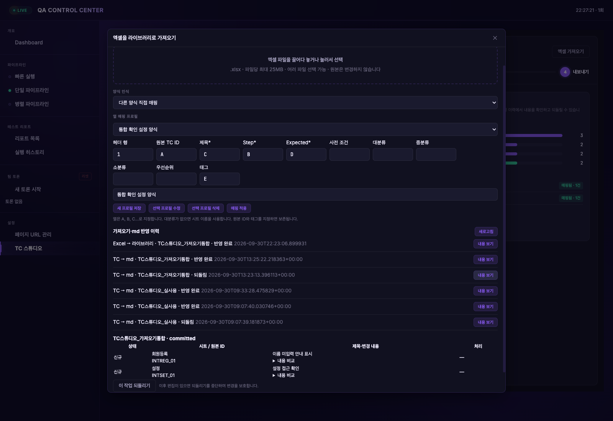
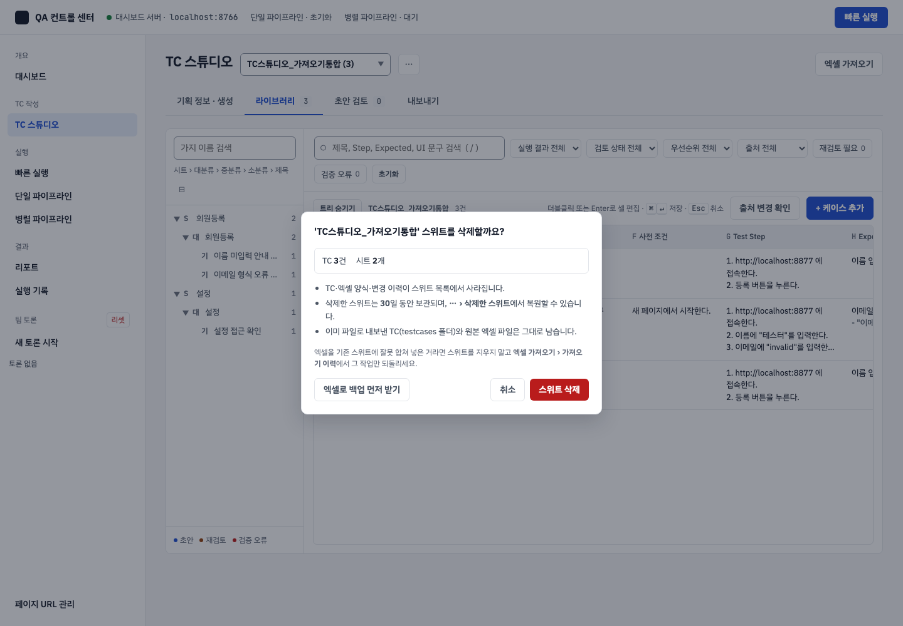
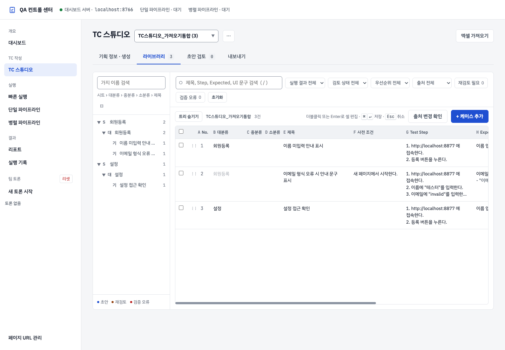
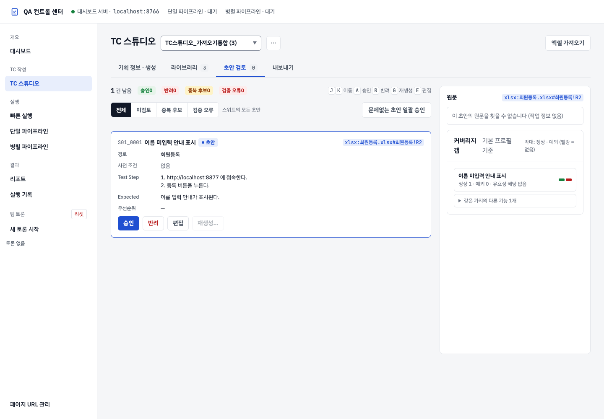
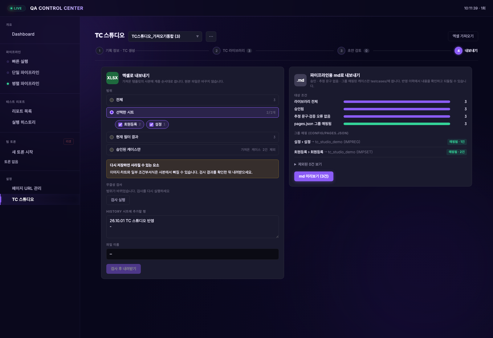

# TC 스튜디오 사용자 설명서

**처음 사용하는 사람을 위한 기획 정보 입력·TC 작성·검토·내보내기 안내**

- 기준 화면: 2026-09-30 구현된 TC 스튜디오.
- 설명 범위: 기획 정보 입력, LLM 초안 생성, TC 직접 작성·수정, 검토, Excel 및 Markdown 내보내기.
- 준비 파일: [빈 TC 엑셀 양식](templates/TC_빈양식.xlsx), [회원 등록 기획 예시](templates/회원등록_기획예시.md).
- 화면의 **제목**은 개별 테스트케이스의 검증 목적을 나타낸다. 기존 Excel 양식에서는 해당 열 이름이 `기능`으로 표시될 수 있다.

> 처음이라면 **1~5장**을 순서대로 읽고 예제를 따라 하세요. 이후 사용하는 기능에 맞춰 상세 설명을 찾아보면 됩니다.

## 목차

1. [TC 스튜디오가 하는 일](#1-tc-스튜디오가-하는-일)
2. [시작하기 전에 준비할 것](#2-시작하기-전에-준비할-것)
3. [화면 구성과 용어](#3-화면-구성과-용어)
4. [처음부터 따라 하기: 기획 정보로 TC 만들고 Excel 내보내기](#4-처음부터-따라-하기-기획-정보로-tc-만들고-excel-내보내기)
5. [같은 TC를 Markdown으로 내보내기](#5-같은-tc를-markdown으로-내보내기)
6. [스위트 선택과 Excel 가져오기](#6-스위트-선택과-excel-가져오기)
7. [시트와 대·중·소분류 관리](#7-시트와-대중소분류-관리)
8. [기획 정보 입력 방법](#8-기획-정보-입력-방법)
9. [작성 규칙과 초안 생성](#9-작성-규칙과-초안-생성)
10. [TC 라이브러리에서 작성·수정하기](#10-tc-라이브러리에서-작성수정하기)
11. [초안 검토와 재생성](#11-초안-검토와-재생성)
12. [Excel 내보내기 상세](#12-excel-내보내기-상세)
13. [Markdown 내보내기 상세](#13-markdown-내보내기-상세)
14. [저장·이력·출처 변경 관리](#14-저장이력출처-변경-관리)
15. [문제가 생겼을 때](#15-문제가-생겼을-때)
16. [내보내기 전 체크리스트](#16-내보내기-전-체크리스트)
17. [자주 묻는 질문](#17-자주-묻는-질문)
18. [단축키와 빠른 참조](#18-단축키와-빠른-참조)

<a id="1-tc-스튜디오가-하는-일"></a>

## 1. TC 스튜디오가 하는 일

TC는 **Test Case**, 즉 테스트케이스의 줄임말입니다. “어떤 조건에서 무엇을 하면 어떤 결과가 나와야 하는가”를 한 항목으로 정리한 문서입니다.

예를 들어 회원 등록 화면의 TC 한 개는 다음처럼 구성됩니다.

| 항목 | 예시 |
|---|---|
| 제목 | 이름 미입력 오류 표시 |
| 사전 조건 | 회원 등록 화면을 처음 연 상태 |
| Test Step | 1. 이름 입력란을 비워 둔다. 2. 등록 버튼을 누른다. |
| Expected Result | 이름 입력을 요구하는 오류 메시지가 표시된다. |
| UI 문구 | 이름을 입력하세요. |
| 우선순위 | P1 |

TC 스튜디오는 기획 정보를 받아 이런 TC의 초안을 만들고, 사람이 내용을 검토·수정한 뒤 파일로 내보내는 도구입니다.

기본 작업 순서는 다음과 같습니다.

**작업할 스위트 선택 → 시트·분류 선택 → 기획 정보 추가 → 초안 생성 → 내용 검토·수정 → 승인 → 내보내기**

LLM은 기획 정보를 읽고 초안을 작성하는 역할을 합니다. 작성된 내용이 실제 요구사항과 맞는지는 사용자가 검토합니다. 기획서에 없는 조건이나 문구가 보이면 원문을 확인하고 수정하세요.

파일은 두 가지 방식으로 내보낼 수 있습니다.

| 형식 | 사용할 때 | 내보낸 결과 |
|---|---|---|
| Excel `.xlsx` | TC를 엑셀로 공유하거나 기존 양식에 맞춰 관리할 때 | 브라우저에서 내려받는 Excel 파일 |
| Markdown `.md` | 승인한 웹 TC를 프로젝트의 Markdown 문서로 보관할 때 | 프로젝트의 `testcases/그룹명/`에 반영되는 파일들 |

**Excel 내보내기를 먼저 익힌 뒤 Markdown 내보내기를 진행하면 이해하기 쉽습니다.** Markdown에는 추가 대상 조건과 그룹 매핑이 있습니다.

<a id="2-시작하기-전에-준비할-것"></a>

## 2. 시작하기 전에 준비할 것

### 2.1 화면 접속

관리자가 알려 준 TC 스튜디오 주소를 브라우저에서 엽니다. 현재 작업 PC에서는 다음 주소를 사용합니다.

**http://localhost:8766/tc-studio**

대시보드 첫 화면을 열었다면 왼쪽 메뉴의 **TC 스튜디오**를 누릅니다.

`localhost`는 현재 사용 중인 컴퓨터를 뜻합니다. 다른 PC에서 작업할 때는 그 PC에서 실행 중인 대시보드 주소나 관리자가 제공한 주소를 사용하세요.

### 2.2 프로그램이 아직 켜져 있지 않을 때

프로젝트의 가상환경과 의존성이 준비된 PC에서는 TC 스튜디오가 포함된 프로젝트 폴더에서 다음 명령으로 대시보드를 켭니다.

```sh
.venv/bin/python agents/dashboard/serve.py --port 8766
```

그다음 브라우저에서 위 주소를 엽니다. 대시보드를 사용 중일 때 이 터미널을 종료하면 웹 요청이 실패할 수 있으므로 켜 두세요.

현재 기능이 구현된 작업 폴더는 `/Users/junghoyoung/qa-native-tc-studio`입니다. 처음 설치하는 PC의 환경 준비는 [프로젝트 README의 설치 안내](../../../README.md#설치)를 확인하거나 관리자에게 요청하세요.

### 2.3 작업 방식별 준비물

| 원하는 작업 | 준비물 |
|---|---|
| 기존 TC 수정·내보내기 | 이미 저장된 스위트 또는 가져올 `.xlsx` |
| 새 TC를 처음부터 작성 | 빈 Excel 양식 또는 사용할 기존 TC 양식 |
| LLM으로 TC 초안 생성 | 기획 문서·직접 적은 설명·접근 가능한 문서 URL 중 하나 이상 |
| Confluence에서 기획 정보 가져오기 | 문서 주소와 해당 문서를 읽을 수 있는 계정 연결 정보 |
| Figma에서 디자인 정보 가져오기 | 디자인 주소와 해당 파일을 읽을 수 있는 개인 액세스 토큰 |
| Markdown 내보내기 | 승인·확인된 UI 문구·유효한 그룹 매핑 |

LLM 초안 생성에는 **이 PC에 설치되고 로그인된 로컬 Claude CLI**가 필요합니다. 로그인 여부를 모르면 터미널에서 `claude`를 실행하여 안내를 확인하거나 관리자에게 요청하세요. TC 스튜디오에서 별도의 LLM API 키를 입력하는 절차는 없습니다.

직접 TC를 작성하거나 기존 TC를 편집하는 작업은 초안 생성 버튼을 사용하지 않고도 할 수 있습니다.

### 2.4 기획서가 없을 때

알고 있는 요구사항을 텍스트로 적어도 됩니다. 다음 항목이 있으면 초안을 만들기 쉽습니다.

- 작성할 화면 또는 기능의 이름.
- 사용자에게 보이는 입력 항목과 버튼.
- 입력값과 조건.
- 사용자가 할 행동.
- 그 행동 뒤에 보여야 하는 결과.
- 확정된 화면 문구.
- 필요하다면 우선순위와 자동화 분류.

문서 파일을 만들 필요 없이 **텍스트 붙여넣기** 탭에 적고 **소스로 추가**를 누르면 됩니다. 연습하려면 이 설명서에 함께 제공한 [기획 예시](templates/회원등록_기획예시.md)를 사용하세요.

<a id="3-화면-구성과-용어"></a>

## 3. 화면 구성과 용어

### 3.1 상단의 네 화면

| 화면 | 역할 | 주로 누르는 버튼 |
|---|---|---|
| **1. 기획 정보 · TC 생성** | 기획 정보를 추가하고 초안을 작성할 시트·분류·규칙을 정함 | 소스로 추가, 시트 추가, 분류 추가, 초안 생성 |
| **2. TC 라이브러리** | 저장된 TC를 찾아 직접 작성·편집함 | + 케이스 추가, 저장, 복제, 삭제, 이동 |
| **3. 초안 검토** | 생성된 내용을 원문과 비교하고 승인·반려·재생성함 | 승인, 반려, 재생성…, 문제없는 초안 일괄 승인 |
| **4. 내보내기** | TC를 Excel 또는 Markdown 파일로 내보냄 | 검사 실행, 내려받기, md 미리보기, md 반영 |

각 화면은 상단의 번호와 이름을 눌러 이동합니다. 번호는 작업 순서를 설명하기 위한 표시이며, 이미 저장된 TC를 수정할 때는 바로 **TC 라이브러리**를 사용할 수 있습니다.



*기획 정보 · TC 생성 화면. 왼쪽은 기획 정보, 오른쪽은 대상 시트·분류와 작성 규칙입니다. 캡처 속 이름과 건수는 예시 데이터입니다.*

### 3.2 스위트, 시트, 분류, 제목의 차이

| 용어 | 쉬운 설명 | 예시 |
|---|---|---|
| 스위트 | 함께 관리하는 TC 전체 묶음 | 회원등록_2026 |
| 시트 | 스위트 안에서 TC를 나누는 큰 단위. Excel의 시트에 대응 | 회원등록 |
| 대분류 | 시트 안의 첫 번째 분류 | 등록 폼 |
| 중분류 | 대분류 안에서 더 나누고 싶을 때 사용하는 분류 | 입력 검증 |
| 소분류 | 중분류 안에서 더 세분화하는 분류 | 이름 |
| 제목 | TC 한 개가 무엇을 확인하는지 나타내는 이름 | 이름 미입력 오류 표시 |

이 예시의 전체 위치는 다음과 같습니다.

**회원등록_2026 → 회원등록 → 등록 폼 → 입력 검증 → 이름 → 이름 미입력 오류 표시**

중분류와 소분류는 선택 사항입니다. 처음에는 **시트 + 대분류 + TC 제목**만 사용해도 됩니다.

같은 대분류에 여러 TC를 넣을 수 있습니다. 각 TC의 제목은 서로 다른 검증 목적을 구별할 수 있게 작성하세요.

### 3.3 처음 접속했을 때 보이는 화면

- 마지막으로 보던 스위트가 자동으로 선택됩니다. 처음이라면 목록의 첫 스위트가 선택됩니다.
- TC가 있는 스위트에서는 **TC 라이브러리**(기존 TC 목록)가 열립니다.
- TC가 0건인 빈 스위트(예: 기본양식)에서는 **기획 정보 · TC 생성** 화면이 열립니다. 대시보드의 다른 메뉴에 갔다가 돌아와도 같습니다.
- 스위트 선택 목록에서 기존 스위트를 고르면 저장된 TC를 불러옵니다.
- 검토할 초안이 남은 생성 작업이 있으면 **기획 정보 · TC 생성** 탭에서 그 작업의 소스·생성 대상·진행 상태를 이어서 볼 수 있습니다. 예전 작업에는 `지난 작업 · 09-30 16:50`처럼 시각이 붙고, 오른쪽 ✕로 닫을 수 있습니다.
- 초안 검토를 모두 마친 작업은 다시 나타나지 않습니다. 이때 **기획 정보 · TC 생성** 탭은 소스와 시트·분류가 비어 있는 새 양식으로 시작합니다.

기존 스위트를 여는 데 Excel을 다시 올릴 필요는 없습니다. 상단의 **엑셀 가져오기**는 새 양식을 등록하거나 Excel 내용을 가져올 때 사용합니다.

<a id="4-처음부터-따라-하기-기획-정보로-tc-만들고-excel-내보내기"></a>

## 4. 처음부터 따라 하기: 기획 정보로 TC 만들고 Excel 내보내기

이 장에서는 다른 자료 없이 **빈 양식과 제공된 기획 예시**로 처음부터 진행합니다.

### 4.1 빈 양식 준비

1. [빈 TC 엑셀 양식](templates/TC_빈양식.xlsx)을 PC에 저장합니다.
2. 이 파일에는 `History`와 `테스트케이스` 시트가 있고, TC 내용은 비어 있습니다.
3. 파일을 직접 채우지 않아도 됩니다. 빈 양식으로 스위트를 등록한 뒤 웹에서 TC를 작성합니다.

### 4.2 새 스위트 등록

1. TC 스튜디오 상단 오른쪽의 **엑셀 가져오기**를 누릅니다.
2. 파일 선택 영역을 누르거나 파일을 끌어 놓습니다.
3. 방금 저장한 `TC_빈양식.xlsx`를 선택합니다.
4. **양식 인식**은 기본 선택인 **기준 양식 자동 인식**으로 둡니다.
5. 분석이 끝나면 **스위트 이름**을 `회원등록_예제`로 입력합니다.
6. 가져올 시트의 `테스트케이스`가 체크되어 있는지 확인합니다.
7. **case_id 접두어**에는 `REG`처럼 영문 대문자로 시작하는 값을 입력합니다.
8. 버튼이 **0건 가져오기**라고 표시되는 것이 맞습니다. 빈 양식이기 때문입니다.
9. **변경 미리보기**를 누릅니다. TC가 없는 빈 양식은 변경 행이 0건으로 표시됩니다.
10. **0건 가져오기**를 누릅니다.
11. 상단 스위트 선택 목록에 `회원등록_예제 (0)`이 나타나는지 확인합니다.

**여기서 “0건”은 실패를 뜻하지 않습니다.** 양식과 빈 시트만 준비된 상태입니다.

스위트 이름을 이미 사용 중인 이름으로 입력하면 같은 스위트로 가져옵니다. 별도의 연습 묶음을 만들려면 기존 목록에 없는 이름을 사용하세요.

### 4.3 시트 이름 정하기

1. 상단의 **기획 정보 · TC 생성**을 누릅니다.
2. 오른쪽 **작성할 시트·분류**의 **시트** 목록에서 `테스트케이스`를 고릅니다.
3. 옆의 **이름 변경**을 누릅니다.
4. 시트 이름에 `회원등록`을 입력합니다.
5. 모달의 **저장**을 누릅니다.
6. 시트 선택 값이 `회원등록`으로 바뀌는지 확인합니다.

다른 시트를 추가하고 싶다면 **시트 추가**를 사용할 수 있습니다. 이번 연습에서는 시트 하나만 사용합니다.

### 4.4 빈 분류 만들기

1. **대분류**에 `등록 폼`을 입력합니다. 입력칸이 보이지 않으면 대분류 목록의 **+ 새로 만들기…**를 고릅니다.
2. **중분류**와 **소분류**는 `(없음)`으로 둡니다.
3. **분류 추가**를 누릅니다.
4. 대분류에 `등록 폼`이 선택되어 있는지 확인합니다.

이 시점에도 TC는 0건입니다. 먼저 분류를 만들고 그 아래에 초안을 넣는 순서입니다.

### 4.5 기획 정보 추가

1. [회원 등록 기획 예시](templates/회원등록_기획예시.md)를 PC에 저장합니다.
2. 왼쪽의 **PRD 파일** 탭을 선택합니다.
3. 파일 선택 영역을 눌러 `회원등록_기획예시.md`를 올립니다.
4. 아래 **수집한 소스** 목록에 파일 카드가 나타나는지 확인합니다.
5. 파일 이름, 글자 수, 섹션 수를 확인합니다.

파일을 저장하는 대신 문서 내용을 복사해 **텍스트 붙여넣기** 탭에 넣고 **소스로 추가**를 눌러도 됩니다. 같은 내용을 파일과 텍스트로 중복 추가할 필요는 없습니다.

**입력칸에 글자를 적는 것과 소스로 등록하는 것은 다릅니다.** 텍스트 방식에서는 반드시 **소스로 추가**를 누르고 소스 카드가 생겼는지 확인하세요.

### 4.6 작성 규칙과 대상 확인

생성 전에 다음 상태를 확인합니다.

| 항목 | 이번 예제의 값 |
|---|---|
| 스위트 | 회원등록_예제 |
| 시트 | 회원등록 |
| 대분류 | 등록 폼 |
| 중분류·소분류 | 없음 |
| 수집한 소스 | 기획 예시 1개 |
| 작성 규칙 | 기본 |

기본 작성 규칙은 제공된 정보에 근거해 TC를 만들도록 되어 있습니다. 처음에는 그대로 사용하세요.

### 4.7 초안 생성

1. 오른쪽 아래 **초안 생성**을 누릅니다. 소스가 없거나 시트·대분류를 고르지 않았으면 버튼이 눌리지 않고, 버튼 옆에 빠진 항목이 안내됩니다.
2. 진행 영역의 대기 → 수집 → 초안 작성 → 검증 → 완료 상태를 확인합니다.
3. 생성 중에는 다시 생성 버튼을 반복해서 누르지 않습니다.
4. 완료되면 표시된 초안 수와 형식 오류 수를 확인합니다.
5. **초안 검토로 이동**을 누릅니다.

기획 예시에는 다섯 가지 조건이 있습니다. 생성된 TC가 그 조건들을 담고 있는지 검토합니다. LLM의 표현과 케이스 수는 실행마다 달라질 수 있으므로, 정확히 5개가 나오는 것만을 완료 기준으로 삼지 마세요.

### 4.8 초안을 읽고 고치기

각 초안 카드에서 다음 내용을 확인합니다.

1. **제목**이 “등록 폼” 같은 분류명만 반복하지 않고 검증 목적을 나타내는가?
2. **사전 조건**이 시작 상태를 설명하는가?
3. **Test Step**이 실제 사용자 행동 순서인가?
4. **Expected**가 무엇이 보여야 하는지 구체적으로 설명하는가?
5. 오른쪽 **원문**에 이 TC의 근거가 있는가?
6. 필요한 입력값·조건이 빠지거나 문서에 없는 기능이 추가되지 않았는가?

수정이 필요하면 다음과 같이 진행합니다.

1. 초안 카드의 **편집**을 누릅니다.
2. TC 라이브러리의 오른쪽 상세 패널에서 제목이나 내용을 고칩니다.
3. **저장**을 누릅니다.
4. “저장됨” 안내가 나타나는지 확인합니다.
5. 상세 패널을 닫고 **초안 검토** 화면으로 돌아갑니다.

한 TC의 제목 예시는 **이름 미입력 오류 표시**입니다. 제목에는 대분류·중분류를 길게 반복할 필요가 없습니다.

### 4.9 승인

내용이 기획 요구사항과 맞으면 초안 카드의 **승인**을 누릅니다.

- 검증 오류가 있는 초안은 먼저 편집하여 고칩니다.
- 중복 후보가 있으면 중복 처리 방법을 먼저 고릅니다.
- 필요 없는 TC는 **반려**합니다.
- 잘못 승인하거나 반려했다면 직후 안내의 **되돌리기**를 누를 수 있습니다.
- 이 작업의 초안을 모두 승인·반려하면 “생성 화면을 새 양식으로 비웠습니다” 안내가 나타나고, **기획 정보 · TC 생성** 탭이 빈 양식으로 돌아갑니다. 이미 만든 TC와 원문 보기는 그대로 남습니다.

예제에 포함된 UI 문구는 가상의 문구입니다. 실제 화면 또는 확정 디자인에서 확인하지 않았다면 **추정**으로 유지합니다. 추정 문구가 있어도 Excel로 검토용 문서를 만들 수 있습니다.

### 4.10 Excel 내보내기

1. 상단 **내보내기**를 누릅니다.
2. 왼쪽 **엑셀로 내보내기** 카드에서 범위를 **승인된 케이스만**으로 고릅니다.
3. **History 시트에 추가할 행**에 다음과 같이 적습니다.

```text
회원 등록 기획 예시를 기준으로 TC 초안 작성 및 검토
- 이름, 이메일, 약관, 등록 완료, 초기화 조건 정리
```

4. **검사 실행**을 누릅니다.
5. 검사 목록의 일치 여부와 수식 참조 결과를 읽습니다.
6. 표시된 건수가 의도한 범위와 맞는지 확인합니다.
7. **내려받기 (N건)**를 누릅니다.
8. 브라우저의 다운로드 폴더에서 `.xlsx` 파일을 찾습니다.

Excel 파일을 내려받았다면 이 장의 작업이 끝났습니다. 원본 빈 양식은 별도의 파일로 유지되고, TC가 작성된 새 Excel 파일이 내려받아집니다.

<a id="5-같은-tc를-markdown으로-내보내기"></a>

## 5. 같은 TC를 Markdown으로 내보내기

Markdown 내보내기를 사용할 때는 다음 네 조건을 준비합니다.

**승인 + 검증 오류 없음 + 추정 UI 문구 없음 + 그룹 매핑**

검증 오류가 있는 TC도 내보내기 대상에서 제외됩니다.

### 5.1 검토 상태 확인

1. **TC 라이브러리**를 엽니다.
2. TC 행을 눌러 상세 패널을 엽니다.
3. **검토 상태**가 **승인**인지 확인합니다.
4. 값을 바꿨다면 **저장**을 누릅니다.

여러 TC를 승인하려면 행 앞 체크박스로 선택하고 하단 일괄 편집의 **검토 상태…**를 사용합니다.

### 5.2 UI 문구 확인

UI 문구 옆에 **추정**이 있으면 Markdown 내보내기 대상에서 빠집니다.

1. 실제 화면 또는 확정 디자인에서 해당 문구를 찾습니다.
2. TC에 적은 문구와 정확히 비교합니다.
3. 틀린 문구는 먼저 수정합니다.
4. 확인한 문구의 **추정** 배지를 눌러 **확인**으로 바꿉니다.
5. **저장**을 누릅니다.

예제 문서에 적혀 있다는 이유만으로 확인 처리하지 마세요. 아직 실제 화면이나 디자인을 확인할 수 없다면 추정으로 두고 Excel 문서로 검토를 진행합니다.

### 5.3 내보낼 그룹 준비

그룹은 Markdown 파일을 모아 둘 폴더와 연결하는 이름입니다. 스위트 이름이나 시트 이름과는 별개입니다.

1. 왼쪽 메뉴의 **페이지 URL 관리**를 엽니다.
2. **새 페이지 등록**에서 **그룹명**과 **URL**을 입력합니다.
3. 예를 들어 그룹명은 `member_registration`, URL은 실제 회원 등록 페이지 주소를 사용합니다.
4. 설명이 필요하면 **메모**를 적습니다. 다른 선택 항목은 환경에 맞게 설정합니다.
5. **+ 추가**를 누릅니다.
6. 등록 목록에 그룹이 나타나는지 확인합니다.

이미 등록된 그룹이 있으면 그 그룹을 사용하면 됩니다. URL을 모르면 프로젝트 담당자에게 그룹 등록을 요청하세요. 이 단계는 Markdown의 내보낼 위치를 정하기 위한 준비입니다.

### 5.4 TC 분류와 그룹 연결

1. 다시 **TC 스튜디오**를 엽니다.
2. 작업하던 스위트를 선택합니다.
3. **내보내기**를 누릅니다.
4. 오른쪽 **파이프라인용 md로 내보내기** 카드의 **그룹 매핑**을 봅니다.
5. 그룹이 없는 분류에서 `member_registration` 같은 등록된 그룹을 고릅니다.
6. **접두어**에 `REG`를 적습니다.
7. **매핑 추가**를 누릅니다.
8. 해당 분류가 **매핑됨**으로 표시되는지 확인합니다.

Markdown 접두어는 영문 대문자로 시작하는 **2~8자**입니다. 예를 들어 `REG`, `LOGIN`, `PAY1`을 사용할 수 있습니다.

### 5.5 미리보기와 반영

1. **대상 조건**의 마지막 건수를 확인합니다.
2. **md 미리보기 (N건)**를 누릅니다.
3. 파일별 상태, 케이스 ID, 대상 파일 경로, 이유를 읽습니다.
4. 충돌 항목이 있다면 처리 방법을 고릅니다. 자세한 기준은 [13장](#13-markdown-내보내기-상세)에 있습니다.
5. 내용을 확인한 뒤 **md 반영**을 누릅니다.
6. **반영 완료 · 신규 N · 갱신 N** 안내를 확인합니다.

Markdown은 Excel처럼 브라우저 다운로드 파일을 만드는 방식이 아닙니다. 프로젝트 폴더의 다음 위치에 반영됩니다.

```text
프로젝트 폴더/
└─ testcases/
   └─ member_registration/
      ├─ tc_REG_01_제목.md
      ├─ tc_REG_02_제목.md
      └─ ...
```

파일명은 실제 TC 제목과 지정한 접두어·번호에 따라 달라집니다. 파일 경로는 미리보기에서 확인할 수 있습니다.

**md 반영 완료**가 이 설명서의 Markdown 내보내기 완료 지점입니다.

<a id="6-스위트-선택과-excel-가져오기"></a>

## 6. 스위트 선택과 Excel 가져오기

### 6.1 기존 작업 열기

화면 상단의 스위트 목록에서 작업할 이름을 고릅니다. 괄호 안 숫자는 해당 스위트에 저장된 TC 개수입니다. 기존 스위트를 선택하면 저장된 TC를 가져옵니다. 매번 Excel을 다시 올릴 필요는 없습니다.

- TC가 있는 스위트: **TC 라이브러리**에서 기존 내용을 확인합니다.
- 빈 스위트: **기획 정보 · TC 생성**에서 정보를 넣고 작성을 시작합니다.
- 다른 스위트로 이동하면 이전 스위트의 검색·선택 상태가 초기화됩니다.
- 상세 패널에 저장하지 않은 수정이 있으면 스위트를 바꾸기 전에 저장·버리기·계속 편집 중 하나를 고르는 창이 나타납니다.
- 스위트 목록은 선택 상자 아래로 펼쳐집니다. Chrome이 아닌 브라우저에서는 운영체제 기본 목록 모양으로 보일 수 있습니다.

예제 작성 중 다른 스위트를 선택했다면 다시 예제 스위트를 고른 뒤 작업하세요. 상단 이름을 확인하는 습관을 들이면 다른 자료를 수정하는 실수를 줄일 수 있습니다.

### 6.2 기존 Excel로 시작하기

1. **엑셀 가져오기**를 누릅니다.
2. `.xlsx` 파일을 하나 이상 선택하거나 끌어 놓습니다. 파일마다 25MB 이하여야 합니다.
3. **양식 인식** 방법을 고르고, 필요한 경우 열 매핑을 설정한 뒤 **매핑 적용**을 누릅니다.
4. **스위트 이름**, 파일별로 가져올 시트, 시트별 **case_id 접두어**를 확인합니다. 시트마다 저장된 매핑 프로필을 선택할 수도 있습니다.
5. **변경 미리보기**를 누릅니다. 신규·갱신·동일·충돌·오류와 변경 전후 내용을 확인합니다.
6. 충돌마다 **건너뛰기** 또는 **라이브러리 값 갱신**을 선택합니다. 오류 행은 **건너뛰기**로 제외하거나 파일·매핑을 고쳐 다시 미리봅니다.
7. **가져오기**를 누르고 추가·갱신·그대로 개수를 확인합니다. 라이브러리에서 제목·Step·Expected가 올바른지 확인합니다.

변경 미리보기는 화면에서 가져오기 전에 반드시 거칩니다. 파일·시트·스위트·매핑을 바꾸면 다시 미리보세요. 미리보기 뒤 원본 업로드나 스위트 내용이 변경되면 반영을 중단합니다.

기준 양식은 대분류·기능·Test Step·Expected Result 헤더를 자동으로 찾습니다. 사용자 설명서의 빈 양식은 이 방법으로 가져올 수 있습니다.

스위트 이름은 한글·영문·숫자·밑줄·하이픈을 사용하고 공백을 넣지 마세요. 밑줄로 시작하는 이름은 사용할 수 없습니다. 예: `회원등록_예제`, `release_2026_09`.

가져오기 접두어는 대문자 영문으로 시작하는 대문자·숫자 조합이며 최대 8자입니다. 예: `REG`, `LOGIN2`. 내부 TC ID와 원본 TC ID, Markdown의 그룹 접두어는 별도로 관리됩니다.

**여러 파일에서 같은 이름의 시트를 동시에 선택할 수는 없습니다.** 해당 시트 선택을 해제하거나 원본 파일의 시트 이름을 구분한 뒤 다시 가져오세요. 한 파일씩 가져오더라도 같은 스위트의 같은 이름 시트는 같은 템플릿으로 취급되므로 서로 다른 양식이면 스위트를 나누는 편이 안전합니다.

### 6.3 다른 Excel 양식의 열 연결과 프로필



자동 인식은 `대분류`·`기능`·`Test Step`·`Expected Result` 헤더(영문 `Main Category`·`TC Summary`·`Step`도 인식)를 찾습니다. 시트를 하나도 찾지 못하면 화면에 안내가 나오고, 이때 **다른 양식 직접 매핑**을 선택합니다. 결과 열 아래 칸의 `Test Level`은 우선순위로 가져옵니다(BAT·Level 1→P0, Level 2→P1, Level 3→P2, Level 4→P3).

| 입력 | 지정할 내용 |
|---|---|
| 헤더 행 | 열 이름이 적힌 행 번호 |
| 원본 TC ID | 원본 자료의 식별자가 있는 열 |
| 제목·Step·Expected | 제목·수행 절차·기대 결과가 있는 열. 세 항목은 필수 |
| 사전 조건 | 시작 조건이 있는 열 |
| 대·중·소분류 | 각 분류가 있는 열. 대분류가 없으면 시트 이름 사용 |
| 우선순위 | P0~P3 또는 `BAT`·`Level 1~4` 값이 있는 열 |
| 태그 | 원본 태그가 있는 열 |

열은 `A`, `B`, `C`처럼 Excel의 열 문자로 지정합니다(소문자나 `B열`도 됩니다). 헤더 행만 숫자로 넣습니다. 쓰지 않는 항목은 비워 둡니다. 원본 ID와 태그를 연결하면 라이브러리에 보존합니다. 태그가 연결된 양식으로 Excel을 내보내면 태그도 출력되며, Markdown은 표준 태그 검증을 적용합니다. 비표준 태그를 임의로 자동 교체하지 않습니다.

예: 10행에 헤더가 있고 B열 ID · C~E열 분류 · F열 제목 · G열 사전 조건 · H열 Step · I열 기대 결과 · J열 Test Level인 양식

| 헤더 행 | 원본 TC ID | 제목 | Step | Expected | 사전 조건 | 대·중·소분류 | 우선순위 |
|---|---|---|---|---|---|---|---|
| `10` | `B` | `F` | `H` | `I` | `G` | `C`·`D`·`E` | `J` |

이 양식은 자동 인식으로도 잡히므로 직접 매핑은 자동 인식이 실패할 때만 씁니다. 직접 매핑은 선택한 모든 시트에 같은 열을 적용하고, 병합 셀·요약 수식 보정 없이 값만 가져옵니다.

**열 매핑 프로필**에서 기존 Import 프로필도 선택할 수 있습니다. 이름을 입력해 **새 프로필 저장**, 선택한 프로필의 **수정**·**삭제**를 할 수 있습니다. 헤더 행·열 연결을 함께 저장합니다. 프로필을 선택하거나 열 연결을 바꾼 뒤에는 **매핑 적용**으로 파일을 다시 분석하세요. 파일·시트 목록의 **시트별 매핑**은 공통 매핑 대신 사용할 저장 프로필을 지정합니다.

### 6.4 빈 양식과 재가져오기

빈 양식의 **0건**은 정상입니다. 변경 미리보기를 거친 뒤 가져오면 양식과 시트가 준비됩니다.

같은 파일명·시트·원본 TC ID는 기존 케이스와 연결하며 내부 ID를 유지합니다. 원본 ID가 없으면 Excel 출처의 행 위치가 연결 기준이므로 행 이동·파일 이름 변경 후에는 미리보기를 특히 확인하세요. 같은 원본 ID가 중복되면 오류로 표시하며 자동 덮어쓰지 않습니다. 내보낸 Excel의 `기타(id/src)`에 있는 내부 ID를 임의로 지우거나 바꾸지 마세요.

새로 가져온 케이스는 승인 상태로 등록됩니다. 기존 케이스를 갱신할 때는 검토 상태를 유지합니다. 승인 표시만 보고 내용 검토가 끝났다고 판단하지 말고 실제 내용을 확인하세요. 모든 케이스는 라이브러리에 보관하며 Markdown은 승인·문구 확인·검증·그룹 연결 조건을 충족한 케이스만 내보냅니다.

### 6.5 가져오기·md 이력과 되돌리기



1. **엑셀 가져오기 → 가져오기 이력**을 누릅니다. 파일을 새로 올리지 않아도 조회할 수 있습니다.
2. **Excel → 라이브러리**, **기존 Excel → md**, **TC → md** 중 필요한 작업의 **내용 보기**를 누릅니다.
3. 변경 전후 내용과 상태를 확인합니다. md 작업의 제외 건은 **제외 목록 CSV**로 받을 수 있습니다.
4. 반영 완료 작업을 복구하려면 **이 작업 되돌리기**를 누릅니다.

Excel 가져오기 복구는 케이스·템플릿·템플릿 프로필·분류·md 연결 자료를 함께 복구하고 이력을 남깁니다. 작업 반영 뒤 수정한 자료가 있으면 복구를 중단하여 이후 편집을 보호합니다. md 작업은 기존 파일 스냅샷으로 복구하며, TC → md 작업은 라이브러리의 내보내기 기록도 함께 되돌립니다. 손상된 작업 기록은 안내를 표시하고 다른 기록은 계속 조회할 수 있습니다.

### 6.6 스위트 삭제와 복원

테스트용으로 만든 스위트나 더 쓰지 않는 스위트는 삭제할 수 있습니다. 삭제는 **지금 선택된 스위트**에만 적용됩니다.



*스위트 삭제 확인 창. 스위트 이름과 TC·시트 개수, 삭제 후 남는 것을 보여 줍니다.*

1. 상단 스위트 목록에서 지울 스위트를 고릅니다.
2. 목록 옆 **⋯(스위트 관리)** 버튼을 누르고 **현재 스위트 삭제…**를 고릅니다.
3. 확인 창에서 스위트 이름과 TC·시트 개수를 확인합니다.
4. 필요하면 **엑셀로 백업 먼저 받기**를 눌러 내보내기 화면에서 범위 **전체**로 검사한 뒤 내려받습니다. 백업한 뒤 다시 1번부터 진행합니다.
5. **스위트 삭제**를 누릅니다.
6. 목록의 다음 스위트로 자동 전환되고, 오른쪽 아래에 삭제 안내가 나타납니다.

삭제하면 다음과 같이 처리됩니다.

| 대상 | 처리 |
|---|---|
| TC·엑셀 양식·변경 이력·md 그룹 매핑 | 스위트 목록에서 사라지고 휴지통에 30일 동안 보관 |
| 이 스위트의 생성 작업·가져오기 이력 | 함께 휴지통으로 이동 (가져오기 이력 화면에서도 사라짐) |
| 이미 파일로 내보낸 TC (`testcases/그룹명/`) | 그대로 남음 |
| 원본 엑셀 파일, 내려받은 Excel 파일 | 그대로 남음 |

**복원하는 방법**

- 삭제 직후 안내의 **되돌리기**를 누르면 바로 복원됩니다. 안내는 약 12초 동안 표시됩니다.
- 안내가 사라진 뒤에는 **⋯ › 삭제한 스위트**를 엽니다. 목록에서 스위트 이름, TC·시트 개수, 삭제 시각, 남은 보관 일수를 확인하고 **복원**을 누릅니다.
- 30일이 지난 스위트는 자동으로 영구 삭제되어 복원할 수 없습니다.
- **기본양식** 스위트는 처음 접속할 때 쓰는 기본 양식이라 삭제할 수 없습니다. 메뉴의 **현재 스위트 삭제…**가 비활성화됩니다. 엑셀을 가져올 때도 스위트 이름 기본값은 기본양식이 아니라 파일 이름입니다.
- 30일을 기다리지 않고 지우려면 **삭제한 스위트** 목록에서 **영구삭제**를 누르고, 행에 나타나는 **영구삭제 확정**을 다시 누릅니다. 영구삭제한 스위트는 복원할 수 없습니다.

주의할 점:

- **초안 생성이 진행 중인 스위트는 삭제할 수 없습니다.** 생성이 끝나거나 작업을 취소한 뒤 삭제하세요.
- 상세 패널에 저장하지 않은 수정이 있으면 먼저 저장·버리기를 묻습니다.
- 삭제한 스위트와 **같은 이름의 스위트가 이미 있으면 복원되지 않습니다.** 같은 이름의 스위트를 먼저 삭제한 뒤 복원하세요.
- 엑셀을 기존 스위트에 잘못 합쳐 넣은 경우라면 스위트를 지우지 말고 [6.5장](#65-가져오기md-이력과-되돌리기)의 **이 작업 되돌리기**로 그 가져오기만 취소하세요.
- 다른 탭에서 같은 스위트를 열어 둔 채 삭제하면, 그 탭의 저장은 "스위트가 없습니다" 오류로 거절됩니다. 새로고침하여 다른 스위트를 고르세요.

기존 **Import Studio** 메뉴는 TC 스튜디오에 통합했습니다. 예전 `/import-studio` 주소로 접속하면 `/tc-studio`로 이동합니다.

<a id="7-시트와-대중소분류-관리"></a>

## 7. 시트와 대·중·소분류 관리

### 7.1 시트와 분류의 차이

시트는 Excel의 탭 단위이고, 분류는 그 안에서 TC를 묶는 기준입니다.

```text
스위트: 회원등록_예제
└─ 시트: 회원등록
   └─ 대분류: 등록 폼
      ├─ 중분류: 입력 검증
      └─ 중분류: 등록 완료
```

시트 이름과 분류 이름을 TC 제목에 반복해서 넣을 필요는 없습니다. 제목은 `이름 미입력 오류 표시`처럼 개별 검증 목적을 적습니다.

### 7.2 시트 추가와 이름 변경

**기획 정보 · TC 생성**에서 시트 선택 영역의 **시트 추가**를 누르고 이름을 입력합니다. 새 시트에는 양식이 준비되며 TC 내용은 복사되지 않습니다.

기존 시트 이름을 바꾸려면 해당 시트를 선택하고 **이름 변경**을 누릅니다. 화면 안에 나타나는 입력창에 새 이름을 입력하고 확인합니다. 이름을 바꿔도 기존 TC ID는 유지됩니다.

시트 이름은 최대 31자입니다. Excel에서 허용하지 않는 `:`, `\`, `/`, `?`, `*`, `[`, `]`는 사용할 수 없으며 같은 스위트에 이미 있는 시트 이름과 겹치면 안 됩니다.

### 7.3 TC 없이 빈 분류 만들기

1. 대상 시트를 고릅니다.
2. 대분류에서 **+ 새로 만들기…**를 선택하고 이름을 입력합니다.
3. 필요하면 중분류와 소분류도 같은 방법으로 입력합니다.
4. **분류 추가**를 누릅니다.
5. 라이브러리의 분류 목록에서 추가한 경로를 확인합니다.

대분류는 필요하고 중·소분류는 선택 사항입니다. 소분류를 쓰려면 상위 중분류도 지정해야 합니다. 아직 TC를 만들지 않았어도 분류를 먼저 준비할 수 있습니다.

이미 만들어진 분류를 반드시 사용할 필요는 없습니다. 자신의 문서에 맞춰 빈 분류를 추가하고 그곳에 작성하세요. 분류 구조를 바꾸려면 새 경로를 만든 뒤 케이스를 이동할 수 있습니다.

### 7.4 TC를 다른 분류로 옮기기

라이브러리에서 케이스를 선택하고 이동 기능을 사용합니다. 대상 시트와 분류 경로를 고르고 반영합니다. 제목을 함께 변경하는 입력란은 비워 두면 기존 제목을 유지합니다. 행의 이동 핸들을 분류에 끌어 놓는 방법도 사용할 수 있습니다.

이동 후에는 왼쪽 분류와 상세 내용에서 위치를 확인하세요. 생성 화면의 대상 분류도 이후 작성할 위치에 맞게 다시 선택합니다.

<a id="8-기획-정보-입력-방법"></a>

## 8. 기획 정보 입력 방법

### 8.1 정보를 입력하는 곳

첫 번째 탭인 **기획 정보 · TC 생성**에서 입력합니다. 라이브러리 검색창은 기획 정보를 넣는 곳이 아닙니다.


여러 소스를 함께 추가할 수 있습니다. 예를 들어 기획 문서 파일에 변경 사항을 붙여넣고, 디자인 URL을 추가하여 한 번에 참고하게 할 수 있습니다. 서로 충돌하는 요구사항은 어느 것이 최신인지 명시하세요.

### 8.2 파일 추가

PRD 파일 입력에서 `.pdf`, `.docx`, `.md`, `.txt` 파일을 선택합니다. 파일은 25MB 이하, PDF는 200페이지 이하를 사용합니다.

추가 후 소스 카드의 파일명과 읽어 들인 내용 정보를 확인합니다. 스캔 이미지로만 된 PDF는 텍스트를 읽지 못할 수 있습니다. 이 경우 텍스트 문서로 바꾸거나 필요한 내용을 직접 붙여넣으세요. 매우 긴 문서는 일부 내용이 잘릴 수 있으므로 잘림 경고를 확인하고 작성할 범위별로 나눕니다.

### 8.3 텍스트 붙여넣기

1. 붙여넣기 영역에 요구사항을 입력합니다.
2. **소스로 추가**를 누릅니다.
3. 추가된 소스 카드가 나타나는지 확인합니다.

입력창에 쓰기만 하고 생성하면 소스로 반영되지 않을 수 있습니다. **소스로 추가**를 누른 뒤 카드가 생겼는지 확인하세요. 입력은 1MB 이내로 작성합니다.

다음 항목을 포함하면 초안을 검토하기 쉬워집니다.

- 화면 또는 기능 이름과 작성할 범위.
- 입력 필드, 버튼, 사용자에게 보이는 정확한 문구.
- 시작 조건, 사용자의 행동, 그 행동 뒤의 결과.
- 정상 조건과 명시된 오류·예외 조건.
- 적용하지 않을 범위와 아직 결정되지 않은 사항.
- 우선순위 지정이 필요하다면 해당 기준.

기획 정보가 없다면 제공된 [회원 등록 예시](templates/회원등록_기획예시.md)로 사용 방법을 연습하세요. 실제 제품에 내보낼 때는 연습용 내용을 실제 요구사항으로 교체합니다.

### 8.4 공개 URL 추가

**PRD URL**에 공개 HTTPS 주소를 넣고 가져옵니다. 지원되는 문서의 텍스트를 읽어 소스로 추가합니다. 로그인해야 하는 일반 웹 주소나 로컬 주소는 이 방법으로 가져오지 못할 수 있습니다.

가져온 카드의 내용이 실제 문서인지 확인하세요. 로그인 안내나 접근 거부 페이지가 읽혔다면 파일 또는 텍스트를 사용하거나 해당 서비스의 연결 설정을 이용합니다.

### 8.5 Confluence와 Figma

**연결 설정**에서 필요한 서비스 계정을 설정합니다.

| 서비스 | 준비할 정보 |
|---|---|
| Confluence Cloud | 기본 URL, 이메일, API 토큰 |
| Confluence Server/DC | 기본 URL, 배포 유형, 개인 액세스 토큰 |
| Figma | 개인 액세스 토큰 |

회사에서 허용한 계정과 토큰을 사용하세요. 토큰 발급 방법이나 권한 범위는 회사 관리자에게 확인합니다. 저장된 토큰 값은 화면에 그대로 표시되지 않으며 토큰 입력을 비워 두면 기존 값을 유지합니다.

Confluence 문서 URL을 넣고 가져옵니다. **하위 페이지 포함**을 선택하면 바로 아래 문서도 함께 가져올 수 있습니다. 가져오는 수에는 제한이 있으므로 필요한 문서가 카드에 포함됐는지 확인합니다.

Figma는 디자인 파일 또는 프레임 URL을 넣습니다. 특정 프레임이 필요하면 `node-id`가 포함된 프레임 링크를 사용합니다. 프레임을 지정하지 않으면 상위 프레임 일부만 가져올 수 있으므로 필요한 화면이 들어왔는지 확인하세요.

### 8.6 소스 제거와 출처 확인

소스 카드의 제거 버튼으로 이번 생성에 사용할 소스를 제외할 수 있습니다. 이는 이미 생성한 TC를 삭제하는 동작이 아닙니다. 제거한 소스로 이미 만든 초안은 **초안 검토**의 원문 보기와 **재생성…**을 계속 사용할 수 있습니다.

같은 파일을 여러 번 추가하거나 구버전·신버전을 섞으면 기준이 모호해질 수 있습니다. 생성 전에 카드 목록을 정리하고, 변경된 부분과 적용 기준을 텍스트로 명확히 적으세요.

<a id="9-작성-규칙과-초안-생성"></a>

## 9. 작성 규칙과 초안 생성

### 9.1 작성 프로필

작성 프로필은 LLM이 초안을 작성할 때 따를 규칙입니다. 기본 규칙은 제공된 정보에 근거하고, 한 TC가 한 목적을 검증하며, 명시된 조건을 구분하고, 관찰 가능한 Step과 Expected Result를 작성하도록 안내합니다.

기본 프로필이 특정 개수의 정상·예외 TC를 억지로 만들도록 요구하지는 않습니다. 문서에 조건이 부족하면 먼저 요구사항을 보충하세요.

**규칙 편집**에서 한 줄에 한 규칙을 작성할 수 있습니다. 예:

```text
기획서에 명시된 조건만 작성한다.
오류 메시지는 원문의 문구를 그대로 사용한다.
동일한 기대 결과를 가진 중복 케이스는 만들지 않는다.
```

저장하려면 **저장할 프로필 이름**을 입력하고 **저장**을 누릅니다. 같은 이름으로 저장하면 해당 프로필이 갱신될 수 있습니다. 다른 작업에서도 선택할 수 있는 규칙이므로 특정 기획 내용을 공용 규칙에 섞지 않는 편이 좋습니다.

우선순위가 명시되지 않은 초안은 기본 P2를 사용할 수 있습니다. Markdown 내보내기 전에 승인·검증·문구 확인·그룹 연결 조건을 확인합니다.

### 9.2 생성 직전 확인

- 상단 스위트와 대상 시트가 맞는가?
- 대분류와 필요한 하위 분류를 지정했는가?
- 소스 카드에 실제 사용할 정보가 들어 있는가?
- 선택한 작성 규칙이 이번 문서에 맞는가?

기존 승인 케이스가 대상 분류에 있으면 작성 예시로 참고할 수 있습니다. 빈 분류에서도 생성할 수 있습니다.

### 9.3 생성과 진행 상태

**초안 생성**은 소스를 하나 이상 추가하고 시트와 대분류를 고른 뒤에 누를 수 있습니다. 누르면 대기·자료 수집·초안 작성·검증 등의 진행 상태가 표시됩니다. 로컬 Claude CLI가 로그인된 환경이어야 실제 LLM 생성이 동작합니다. 생성 중에는 진행 영역을 확인하고 같은 요청을 반복해서 누르지 마세요.

완료되면 **초안 검토**에서 작성된 내용을 확인합니다. 문서와 규칙에 따라 생성 개수와 내용이 달라지므로 예제와 항상 같은 개수가 나온다고 가정하지 마세요.

생성 도중 취소할 수 있습니다. 오류가 발생했더라도 일부 초안이 남아 있다면 **살린 초안 검토**로 내용을 확인하거나 **실패한 섹션만 다시 생성**을 사용합니다. 표시된 오류와 로그를 확인한 뒤 필요한 부분만 다시 시도하세요.

<a id="10-tc-라이브러리에서-작성수정하기"></a>

## 10. TC 라이브러리에서 작성·수정하기



### 10.1 표 읽기

| 항목 | 작성 기준 |
|---|---|
| 대·중·소분류 | 케이스가 속한 경로. 대분류는 필수 |
| 제목 | 검증 목적이 드러나는 짧고 구체적인 이름 |
| 사전 조건 | 수행 전에 준비되어 있어야 할 상태 |
| Test Step | 사용자가 수행할 행동을 순서대로 작성 |
| Expected Result | 행동 뒤에 확인할 수 있는 구체적인 결과 |
| 우선순위 | 팀의 기준에 맞는 P0~P3 |
| 실행결과 | 선택 입력 항목. TC 작성·내보내기를 위해 결과를 기록할 필요는 없음 |
| 기타(id/src) | 케이스 ID와 출처 등 관리 정보 |

표가 화면보다 넓으면 가로로 스크롤하여 오른쪽 항목을 확인합니다. **승인 상태**와 **실행결과**는 별개입니다.

화면을 넓게 쓰는 방법:

- 표 위의 **트리 숨기기**를 누르면 왼쪽 분류 목록을 접고 표를 넓게 봅니다. **트리 보기**로 다시 펼치며, 선택은 다음 접속에도 유지됩니다.
- 노트북처럼 폭이 좁은 화면에서는 상세 패널이 표 위에 겹쳐 열리고, 여는 동안 분류 목록이 잠시 접힙니다. 패널을 닫으면 돌아옵니다.
- 긴 셀은 4줄까지만 보이고 나머지는 `…`로 줄어듭니다. 전체 내용은 셀을 편집하거나 상세 패널에서 확인합니다.
- TC가 많으면 처음 150행을 먼저 보여 주고, 표 끝의 `150 / N건 표시` 줄까지 스크롤하면 다음 행을 이어서 불러옵니다. 이 설명서에서는 작성 내용의 검토와 승인만 다룹니다.

### 10.2 표에서 바로 수정하기

1. 수정할 셀을 두 번 누르거나 선택 후 Enter를 누릅니다.
2. 내용을 입력합니다.
3. Cmd+Enter 또는 Ctrl+Enter로 저장합니다. 다른 곳을 눌러 편집을 종료해도 저장될 수 있습니다.
4. 변경한 내용이 표시되는지 확인합니다.

저장에 실패하면 오류 안내가 나타나고 셀은 서버에 저장된 값으로 돌아갑니다. 안내의 **다시 시도**를 누르면 같은 변경을 다시 저장합니다.

Esc는 현재 셀 편집을 취소합니다. 여러 줄 Step은 `1. ...`, `2. ...` 형태로 번호를 붙입니다. Expected Result에 문구·추정 여부까지 수정할 때는 상세 편집을 사용하면 항목을 확인하기 쉽습니다.

### 10.3 상세 편집하기

행이나 번호를 눌러 상세 패널을 엽니다. **편집**에서 제목·사전 조건·Step·Expected Result·UI 문구·우선순위 등을 수정하고 **저장**을 누릅니다.

저장하지 않은 수정이 있는 상태에서 다른 행을 누르거나, 케이스를 추가하거나, 패널을 닫거나, 스위트를 바꾸면 다음 선택 창이 나타납니다.

| 선택 | 결과 |
|---|---|
| 저장 | 수정 내용을 저장하고 이동 |
| 버리기 | 수정 내용을 지우고 이동 |
| 계속 편집 | 이동하지 않고 편집을 이어 감 (Esc도 같음) |

브라우저 탭을 닫거나 새로고침할 때도 브라우저가 저장하지 않은 변경이 있다고 경고합니다.

Step은 한 항목에 한 행동을 작성합니다. Step 추가로 항목을 늘리고, 불필요한 항목은 제거합니다. 비어 있는 Step을 남기면 저장 오류가 날 수 있습니다. 이동 핸들이나 Alt+위/아래 키로 순서를 바꿀 수 있습니다.

좋은 Expected Result는 `이메일 형식 오류 메시지가 이메일 입력란 아래에 표시된다`처럼 확인할 대상을 설명합니다. `정상 동작한다`처럼 결과를 판단하기 어려운 문장은 구체적으로 바꿉니다.

**UI 문구의 확인 여부**는 실제 기획·디자인·화면에서 문구를 확인했을 때 바꿉니다. 단순히 내보내기 조건을 맞추려고 추정 표시만 해제하지 마세요.

### 10.4 직접 작성·복제·삭제

LLM을 사용하지 않고 **+ 케이스 추가**로 직접 작성할 수 있습니다. 버튼을 여러 번 빠르게 눌러도 한 건만 만들어집니다. 새 케이스의 기본 제목을 검증 목적에 맞게 바꾸고 필수 항목을 채웁니다. 선택된 케이스나 현재 위치에 따라 초기 분류가 정해질 수 있으므로 저장 후 시트·분류를 확인하고 필요하면 이동하세요.

비슷한 케이스는 복제한 뒤 조건과 기대 결과를 바꿉니다. 복제된 케이스는 새 ID를 가진 초안이므로 다시 검토해야 합니다.

삭제 전에 선택한 케이스를 확인하세요. 삭제 직후 되돌리기 안내가 나타나면 해당 시간 안에 복원할 수 있습니다. 이 안내를 영구적인 휴지통 기능으로 생각하지 마세요.

### 10.5 검색·필터·여러 건 변경

라이브러리 검색으로 제목·Step·Expected Result 등의 내용을 찾습니다. 왼쪽 분류 검색은 분류를 찾는 기능입니다. 상태·우선순위 등의 필터를 조합하고, 목록이 이상하게 적으면 검색과 필터를 초기화합니다.

행 체크박스를 선택하면 여러 건에 우선순위·상태 등을 적용하거나 복제·삭제·이동할 수 있습니다. 전체 선택은 현재 표시된 대상에 적용되므로 다른 분류의 케이스까지 선택됐다고 가정하지 마세요. 반영 전에 선택 개수를 확인하고 완료 후 선택을 해제합니다.

내보내기 범위의 **현재 필터 결과**와 체크박스로 선택한 행은 같은 개념이 아닙니다. 원하는 내보내기 범위는 내보내기 화면에서 따로 고릅니다.

<a id="11-초안-검토와-재생성"></a>

## 11. 초안 검토와 재생성



### 11.1 검토 순서

1. 제목이 한 가지 검증 목적을 나타내는지 읽습니다.
2. 출처 버튼을 눌러 원문의 요구사항과 비교합니다.
3. 사전 조건과 Step이 실제로 수행 가능한 순서인지 확인합니다.
4. Expected Result가 원문에 근거하며 구체적인지 확인합니다.
5. 오류·중복·추정 표시를 확인하고 필요한 내용을 수정합니다.
6. 사용할 케이스는 승인하고 불필요한 케이스는 반려합니다.

생성 작업에서 **초안 검토로 이동**하면 그 작업의 초안만 표시됩니다. 상단 **초안 검토** 탭의 숫자는 스위트 전체 초안 수이므로 화면의 남은 건수와 다를 수 있습니다. 다른 초안(직접 추가한 초안 등)도 함께 보려면 작업 정보 옆의 **다른 초안 N건 포함해 보기**를 누릅니다.

원문 인용을 찾지 못한다는 표시가 있으면 출처와 케이스 내용의 연결을 직접 확인합니다. LLM이 붙인 출처만으로 내용이 맞다고 단정하지 마세요.

### 11.2 승인과 반려

**승인**은 작성 내용이 사용할 수준이라고 판단하는 동작입니다. 검증 오류나 미해결 중복이 있으면 먼저 해결해야 합니다. 단일 승인에서는 추정 문구가 남을 수 있지만, 그 경우 Markdown 대상에서는 제외될 수 있습니다.

일괄 승인 기능은 오류·중복·추정 문구가 있는 항목을 건너뛸 수 있습니다. 전체를 눌렀더라도 남은 초안과 제외 이유를 다시 확인합니다.

**반려**는 케이스를 삭제하는 것이 아니라 사용하지 않겠다는 검토 상태입니다. 반려 직후 되돌리기 안내로 취소할 수 있습니다.

### 11.3 한 케이스 다시 생성하기

생성된 케이스에서 **재생성…**을 누르고 수정 요청을 적은 뒤 **이 메모로 재생성**을 누릅니다.

좋은 요청 예:

```text
이 케이스는 이메일 형식만 검증해야 합니다.
이름과 약관 동의는 정상 값으로 준비하도록 사전 조건을 수정하세요.
오류 문구는 원문에 있는 “이메일 형식을 확인하세요.”를 사용하세요.
```

재생성은 기존 케이스의 ID를 유지하며 변경 이력을 남깁니다. 새 내용은 다시 검토하고 승인하세요. 직접 가져온 케이스처럼 생성 작업에 연결되지 않은 항목은 같은 방식의 재생성 기능을 사용할 수 없을 수 있습니다.

### 11.4 중복 처리와 부족한 조건

중복 후보에는 다음 선택지가 표시될 수 있습니다.

| 선택 | 판단 기준 |
|---|---|
| 기존 케이스 갱신 | 같은 목적의 기존 케이스를 새 내용으로 바꾸려는 경우 |
| 건너뛰기 | 기존 케이스로 충분하여 새 후보를 사용하지 않는 경우 |
| 새로 추가 | 조건이나 기대 결과가 달라 별도 케이스가 필요한 경우 |

새로 추가하기 전 제목과 조건을 구분하여 왜 별도 케이스인지 드러내세요. 중복 처리가 끝난 뒤 승인 상태도 확인합니다.

오른쪽 **커버리지 갭**은 이번 초안의 제목을 먼저 보여 주고, 같은 분류의 다른 제목은 **같은 가지의 다른 기능 N개**를 눌러 펼칩니다. 막대는 왼쪽이 정상, 오른쪽이 예외 케이스이며 빨간색은 해당 케이스가 없다는 뜻입니다.

커버리지 안내는 빠진 조건을 검토하는 참고 정보입니다. 요구사항에 없는 예외를 임의로 만들기보다 기획 정보를 보충한 뒤 추가로 생성하거나 직접 작성하세요.

<a id="12-excel-내보내기-상세"></a>

## 12. Excel 내보내기 상세



### 12.1 범위 선택

| 범위 | 내보낼 내용 |
|---|---|
| 전체 | 선택한 스위트의 케이스 |
| 선택한 시트 | 지정한 시트의 케이스 |
| 현재 필터 결과 | 라이브러리에서 현재 필터로 조회한 대상 |
| 승인된 케이스만 | 승인 상태인 케이스 |

여러 시트를 선택할 때는 Cmd 또는 Ctrl 키와 함께 선택합니다. 초안을 공유할 목적이면 전체를, 검토 완료 자료를 전달하려면 승인된 케이스만을 사용할 수 있습니다.

### 12.2 검사 후 내려받기

1. 범위와 시트를 지정합니다.
2. 필요하면 History에 남길 변경 설명을 입력합니다.
3. **검사 실행**을 누릅니다.
4. 검사 개수와 통과·오류 내용을 읽습니다.
5. 내려받기를 눌러 `.xlsx`를 저장합니다.
6. 다운로드 폴더에서 파일을 열고 시트와 대표 케이스를 확인합니다.

이 화면의 **검사**는 내보낸 Excel을 다시 읽어 TC 정보와 참조 오류 등을 확인하는 파일 검사입니다. 사용자 기능을 실행하는 테스트가 아닙니다. 시트 수에 따라 검사 개수가 달라집니다.

검사 이후 TC 내용·범위·History 설명을 바꿨다면 다시 검사하고 최신 파일을 내려받으세요. 이전 검사에서 만든 파일을 최신 내용이라고 착각하지 않도록 합니다.

오류가 있어도 **오류가 있지만 내려받기**가 표시될 수 있습니다. 전달용 파일로 사용하기 전에 오류 원인을 확인하고 수정하는 것을 권장합니다.

### 12.3 양식 보존 범위

가져온 양식을 바탕으로 내보내며 원본 파일 자체를 덮어쓰지 않습니다. 다만 그림·차트·조건부 서식 등 Excel의 모든 요소가 동일하게 보존된다고 보장하지는 않습니다. 복잡한 양식이라면 내려받은 파일의 외관도 확인하세요.

Excel 파일은 TC 공유·교환용입니다. 작성 프로필·생성 작업·전체 출처 이력까지 담은 TC 스튜디오의 전체 백업은 아닙니다.

<a id="13-markdown-내보내기-상세"></a>

## 13. Markdown 내보내기 상세

### 13.1 대상 조건

Markdown 내보내기는 다음 조건을 모두 만족하는 케이스를 대상으로 합니다.

- 검토 상태가 **승인됨**.
- 확인하지 않은 추정 UI 문구가 남아 있지 않음.
- 작성 내용의 검증 오류가 없음.
- 대상 분류가 등록된 페이지 그룹에 연결되어 있음.

Excel에 내보낼 수 있다고 해서 Markdown에도 자동으로 포함되는 것은 아닙니다. 내보내기 화면의 단계별 대상 개수와 제외 사유를 확인합니다. 대상이 0건이면 해당 조건을 먼저 해결합니다.

### 13.2 그룹과 접두어 연결

Markdown 파일이 들어갈 그룹은 대시보드의 페이지 URL 관리에 등록되어 있어야 합니다. 준비 방법은 [5장](#5-같은-tc를-markdown으로-내보내기)을 따릅니다.

내보내기 화면에서 시트·분류를 페이지 그룹에 매핑합니다. 상위 분류에 연결하면 하위 케이스에도 적용할 수 있고, 더 구체적인 하위 분류 매핑이 있으면 해당 연결을 사용합니다.

그룹 접두어는 대문자 영문으로 시작하는 대문자·숫자 2~8자입니다. 같은 접두어를 서로 다른 그룹에 중복 지정하지 마세요. 파일 이름과 경로는 미리보기에서 확인합니다.

### 13.3 미리보기 상태와 충돌

| 상태 | 의미와 확인할 내용 |
|---|---|
| 신규 | 새 파일을 만들 예정 |
| 갱신 | 기존 내보내기 파일을 변경할 예정 |
| 동일 | 현재 내용과 같아 변경할 필요가 없음 |
| 충돌 | 기존 파일이 별도로 변경되어 처리 선택이 필요함 |
| 오류 | 내보내기를 진행하기 전에 원인 수정이 필요함 |

충돌에서는 **건너뛰기** 또는 **라이브러리 값으로 덮어쓰기**를 선택합니다. 별도로 수정한 Markdown 내용을 유지해야 하면 건너뛰고 두 내용을 비교하세요. 덮어쓰기를 선택하면 파일에 직접 수정한 내용이 사라질 수 있습니다.

### 13.4 반영과 롤백

**md 반영**을 누르면 프로젝트의 `testcases/그룹명/`에 파일을 씁니다. 브라우저 다운로드 목록에 `.md` 파일이 생기는 방식이 아닙니다. 완료 안내와 대상 경로를 확인합니다.

반영 직후 **이 작업 롤백**을 사용할 수 있습니다. 이는 해당 내보내기의 파일 변경을 되돌리는 것이며 라이브러리에서 수정한 TC 내용까지 되돌리는 기능은 아닙니다. 파일이 이후에 별도로 변경됐다면 롤백이 거절될 수 있으므로 표시된 안내를 확인합니다.

Markdown 파일을 직접 편집해도 라이브러리로 자동 반영되지는 않습니다. 계속 TC 스튜디오에서 관리하려면 라이브러리 내용을 수정한 뒤 다시 미리보기와 반영을 진행하세요.

<a id="14-저장이력출처-변경-관리"></a>

## 14. 저장·이력·출처 변경 관리

### 14.1 무엇이 저장되는가

| 작업 | 저장을 확인하는 방법 |
|---|---|
| 표 셀 편집 | 편집 종료 후 변경된 셀 확인 |
| 상세 편집 | 저장을 누르고 표시 내용 확인 |
| 시트·분류 추가 | 목록에 새 항목이 표시되는지 확인 |
| 프로필 편집 | 프로필 이름을 지정해 저장 |
| 소스 입력 | 소스로 추가한 카드 확인 |
| LLM 초안 생성 | 완료된 작업과 라이브러리의 케이스 확인 |
| Excel 내보내기 | 다운로드 폴더에서 파일 확인 |
| Markdown 내보내기 | 반영 완료와 프로젝트 파일 경로 확인 |

검토할 초안이 남은 생성 작업은 스위트를 다시 선택했을 때 복원됩니다. 초안 검토를 모두 마친 작업은 복원하지 않고 새 양식으로 시작합니다. 생성하기 전 입력 중인 정보는 브라우저 세션에 의존할 수 있으므로, 기획 원본은 별도로 보관하고 다른 브라우저에서도 항상 자동 복원된다고 가정하지 마세요.

### 14.2 변경 이력과 되돌리기

케이스 상세의 **이력**에서 변경 내용을 확인합니다. 이력의 **되돌리기**로 해당 변경을 되돌릴 수 있으며, 되돌린 작업도 이력에 남습니다. 최신 내용과 비교하고 원하는 변경인지 확인한 뒤 사용하세요.

**원문**에서는 출처 정보를 확인합니다. TC를 수정해도 원래 기획 내용 자체가 변경되는 것은 아닙니다.

### 14.3 출처 변경 확인

**출처 변경 확인**으로 연결된 자료의 변경을 확인할 수 있습니다. 재검토 필요 표시가 나타나면 관련 케이스의 원문과 현재 내용을 비교합니다. 기획 변경에 맞춰 Step·Expected Result·UI 문구를 수정하고 다시 검토하세요.

재검토 표시가 있다는 이유만으로 모든 내보내기가 자동 차단된다고 생각하지 마세요. 내보내기 전에 사용자가 변경된 요구사항을 반영했는지 확인해야 합니다.

<a id="15-문제가-생겼을-때"></a>

## 15. 문제가 생겼을 때

| 증상 | 확인 순서 |
|---|---|
| 화면이 열리지 않음 | 대시보드가 켜져 있는지, 주소와 포트가 맞는지 확인 |
| 기존 자료가 안 보임 | 상단 스위트 이름 → 검색·필터 초기화 → 시트·분류 선택 확인 |
| 빈 양식 가져오기에서 0건 | 정상. 시트·분류를 준비하고 생성 또는 직접 작성 |
| Excel 헤더를 찾지 못함 | 기준 양식인지 확인 → 다른 양식 직접 매핑으로 헤더 행과 필수 열 지정 |
| 시트 이름 저장 실패 | 중복 이름, 31자 제한, 금지 문자 확인 |
| 소스가 생성에 반영되지 않음 | 입력만 했는지 확인 → 소스로 추가 → 카드 내용 확인 |
| PDF 내용이 비어 있음 | 이미지 스캔 문서인지 확인 → 텍스트 파일이나 붙여넣기로 제공 |
| URL 가져오기 실패 | 공개 HTTPS인지 확인 → 로그인 문서는 연결 설정 또는 파일 사용 |
| Confluence·Figma 접근 실패 | 연결 설정과 해당 자료에 대한 계정 권한 확인 |
| 초안 생성 버튼이 눌리지 않음 | 버튼 옆 안내 확인 → 소스 추가, 시트·대분류 선택 |
| 초안 생성 실패 | 로컬 Claude 로그인 상태와 화면 오류 확인 → 남은 초안 검토 또는 실패 구간 재시도 |
| 예전 생성 작업이 계속 보임 | 검토할 초안이 남은 작업입니다. 검토를 마치거나 작업 영역의 ✕로 닫기 |
| 다른 행을 누르자 선택 창이 뜸 | 상세 패널에 저장하지 않은 수정이 있음 → 저장·버리기·계속 편집 중 선택 |
| 표 셀 저장 실패 안내 | 셀은 저장된 값으로 돌아감 → 서버 연결 확인 후 안내의 다시 시도 |
| 표 끝에 “150 / N건 표시” | 정상. 그 줄까지 스크롤하면 다음 행을 불러옴 |
| 표가 좁아 제목이 안 보임 | 트리 숨기기 또는 상세 패널 닫기 |
| 스위트 삭제 버튼이 눌리지 않음 | 확인 창의 안내 확인 → 초안 생성 완료 또는 취소 후 다시 시도 |
| 지운 스위트를 되살리고 싶음 | 삭제 안내의 되돌리기 또는 ⋯ › 삭제한 스위트 › 복원 (30일 이내) |
| 스위트 복원 시 “같은 이름의 스위트가 이미 있습니다” | 같은 이름의 스위트를 먼저 삭제한 뒤 복원, 또는 휴지통 항목을 영구삭제 |
| 저장할 때 “스위트가 없습니다” | 다른 탭에서 스위트가 삭제됨 → 새로고침 후 스위트 선택 |
| 제목·Step·Expected 저장 오류 | 필수 항목과 빈 Step 확인. 오류의 ‘기능’은 제목을 뜻할 수 있음 |
| 승인 버튼 비활성 | 검증 오류 또는 미해결 중복 확인 |
| 일괄 승인 뒤 초안이 남음 | 오류·중복·추정 문구로 건너뛴 항목을 개별 검토 |
| Markdown 대상이 적거나 0건 | 승인 → 추정 문구·검증 오류 → 페이지 그룹 매핑 순서로 확인 |
| Markdown 파일이 다운로드에 없음 | 프로젝트의 testcases/그룹명/ 확인 |
| Markdown 충돌 | 기존 파일의 별도 수정 내용을 비교하고 건너뛰기/덮어쓰기 선택 |
| Excel 내용이 최신이 아님 | 내용과 범위 지정 후 검사 실행을 다시 하고 내려받기 |

오류를 전달해야 한다면 스위트·시트 이름, 누른 버튼, 오류 문구, 발생 시각을 함께 적으세요. 화면을 공유할 때 토큰이나 비공개 기획 내용이 포함됐는지 확인합니다.

<a id="16-내보내기-전-체크리스트"></a>

## 16. 내보내기 전 체크리스트

### 공통

- [ ] 올바른 스위트와 시트를 선택했다.
- [ ] 분류가 실제 작성 범위에 맞다.
- [ ] 제목만 읽어도 각 케이스의 차이를 알 수 있다.
- [ ] Step은 수행 순서대로 작성했고 빈 항목이 없다.
- [ ] Expected Result는 구체적이고 기획 근거가 있다.
- [ ] 중복 후보와 작성 오류를 처리했다.
- [ ] 출처 변경으로 재검토할 항목을 확인했다.
- [ ] 상세 편집 내용을 저장했다.

### Excel

- [ ] 내보낼 범위와 시트를 선택했다.
- [ ] 필요한 History 설명을 적었다.
- [ ] 최종 수정 후 파일 검사를 다시 실행했다.
- [ ] 내려받은 파일의 시트와 대표 TC를 확인했다.

### Markdown

- [ ] 대상 내용을 검토하고 승인했다.
- [ ] UI 문구를 실제 근거로 확인했고 추정 항목을 처리했다.
- [ ] 페이지 그룹과 접두어를 매핑했다.
- [ ] 미리보기의 오류·충돌을 처리했다.
- [ ] 반영 완료와 파일 경로를 확인했다.

<a id="17-자주-묻는-질문"></a>

## 17. 자주 묻는 질문

### 문서가 없으면 시작할 수 없나요?

직접 요구사항을 붙여넣거나 수동으로 TC를 작성할 수 있습니다. 처음 사용하는 연습에는 제공된 회원 등록 기획 예시를 사용하세요. 실제 제품의 요구사항을 모르면 정확한 제품 TC를 완성할 수 없으므로 필요한 조건부터 정리합니다.

### 처음부터 특정 시트나 분류를 사용해야 하나요?

아닙니다. 빈 양식을 가져오고 자신의 시트와 빈 분류를 만들 수 있습니다. 자동으로 정해진 이름이 제품에 맞지 않으면 시트 이름을 바꾸고 분류를 선택하세요.

### 기존 스위트를 선택할 때 Excel을 다시 올려야 하나요?

기존 스위트에 저장된 TC는 선택해서 바로 사용할 수 있습니다. Excel 가져오기는 새 파일을 넣거나 기존 자료를 갱신할 때 사용합니다.

### LLM은 어디에 입력한 정보를 읽나요?

**기획 정보 · TC 생성**에서 추가한 소스 카드의 정보와 선택한 작성 규칙을 읽습니다. 라이브러리 검색창이나 아직 소스로 추가하지 않은 입력만으로 요청하지 마세요.

### 승인하면 모든 내보내기가 가능한가요?

Excel은 선택한 범위로 내보냅니다. Markdown은 승인 외에도 확인된 UI 문구, 검증 오류 없음, 페이지 그룹 매핑이 필요합니다.

### ‘건너뛰기’는 무엇인가요?

중복 검토에서는 새 중복 후보를 사용하지 않는 선택입니다. Markdown 충돌에서는 해당 파일을 이번 반영에서 바꾸지 않는 선택입니다. 버튼이 있는 화면에 따라 대상이 다릅니다.

### Excel의 ‘기능’과 화면의 ‘제목’은 다른가요?

같은 개별 TC 제목을 뜻합니다. 화면은 목적을 쉽게 이해하도록 제목으로 표시하고 기존 Excel 양식의 기능 헤더는 유지할 수 있습니다.

### TC ID를 원하는 문자열로 직접 고쳐도 되나요?

ID는 갱신과 이력 연결에 쓰입니다. 제목이나 분류를 바꾸는 용도로 ID를 수정하지 마세요. Excel 재가져오기와 Markdown 파일 식별에도 영향이 있습니다.

### 파일을 내보내면 라이브러리에서 사라지나요?

아닙니다. 내보내기는 현재 자료를 파일로 만드는 작업입니다. 라이브러리 내용은 계속 편집할 수 있습니다.

<a id="18-단축키와-빠른-참조"></a>

## 18. 단축키와 빠른 참조

| 위치 | 동작 | 단축키 |
|---|---|---|
| 표 셀 | 편집 시작 | Enter 또는 더블 클릭 |
| 표 셀 편집 | 저장 | Cmd+Enter / Ctrl+Enter |
| 표 셀 편집 | 현재 편집 취소 | Esc |
| 상세 편집 | 저장 | Cmd+S / Ctrl+S |
| 상세 Step | 다음 Step 추가 | Step 입력 중 Enter |
| 상세 Step | 순서 이동 | Alt+위 / Alt+아래 |

브라우저나 운영체제가 단축키를 가로채는 경우 화면 버튼을 사용하세요.

| 하고 싶은 일 | 이동할 곳 |
|---|---|
| 기획 파일·텍스트·URL 넣기 | 기획 정보 · TC 생성 |
| 시트 추가·이름 변경·빈 분류 만들기 | 기획 정보 · TC 생성의 대상 선택 |
| TC 직접 작성·수정·검색 | TC 라이브러리 |
| 생성한 내용과 원문 비교·승인·재생성 | 초안 검토 |
| Excel 범위 선택·검사·다운로드 | 내보내기 |
| Markdown 대상 확인·매핑·미리보기·반영 | 내보내기 |
| 변경 이력·출처 확인 | 케이스 상세의 이력·원문 |
| 스위트 삭제·복원 | 스위트 목록 옆 ⋯ 메뉴 |

**처음에는 빈 양식과 예제로 Excel 내보내기까지 한 번 따라 하고, 그다음 실제 기획 정보로 바꿔 작성하세요. Markdown이 필요하면 승인·문구 확인·그룹 매핑을 추가로 진행하면 됩니다.**
